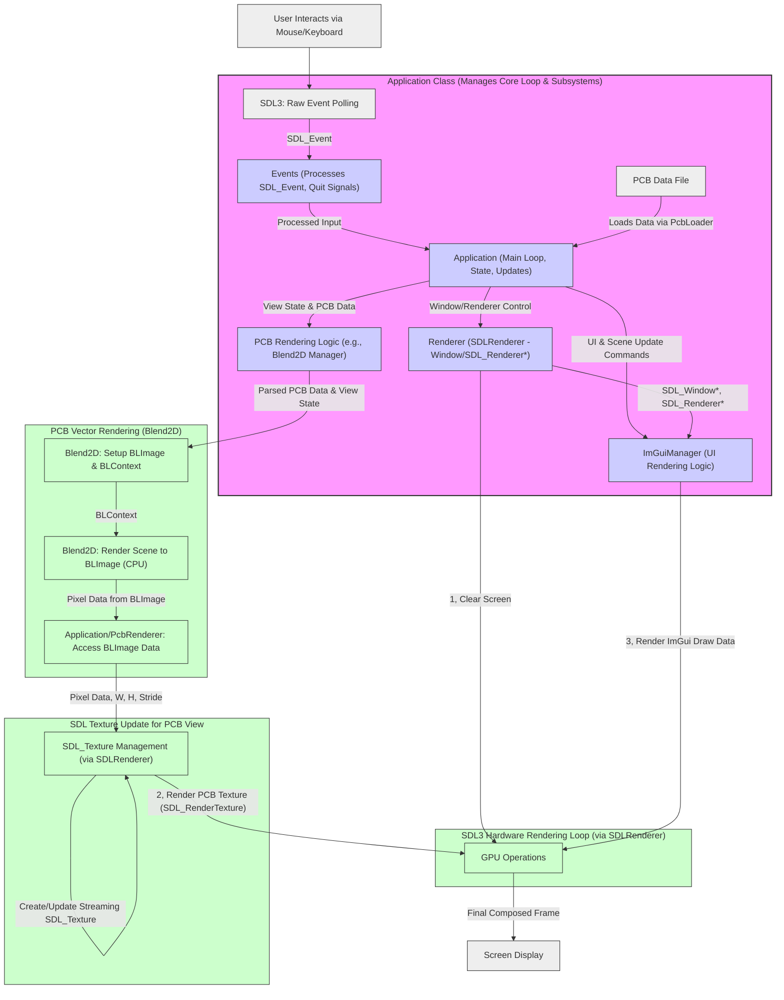

# Project Overview

  This project, the XZZPCB Layer Viewer, is architected around a central Application class designed for clarity, maintainability, and future extensibility. The core philosophy is a separation of concerns, where distinct responsibilities are managed by dedicated subsystem components. User input, initiated via mouse and keyboard, is captured by SDL3's event system and processed by an Events manager within the Application. This manager translates raw input into actionable application events and also funnels input to the UI system. The Application class itself orchestrates the main program loop, managing application state, updates, and coordinating the rendering pipeline.

  The rendering approach is a hybrid model designed to leverage the strengths of different libraries. For the user interface, Dear ImGui is employed, managed by an ImGuiManager. This manager handles ImGui's initialization, UI element rendering, and interaction with the SDL3 rendering backend. The core PCB visualization utilizes Blend2D for high-quality 2D vector graphics rendering of the complex geometries found in PCB designs. This Blend2D rendering occurs off-screen to a pixel buffer (a BLImage). The Application (likely through a dedicated PCB rendering component) then takes this pixel data and transfers it to an SDL_Texture. Finally, the Renderer subsystem (an SDLRenderer implementation) takes responsibility for the hardware-accelerated composition on the GPU: it clears the screen, draws the SDL_Texture containing the PCB visualization, and then draws the ImGui user interface on top. This entire composed frame is then presented to the screen. This layered approach ensures that complex vector rendering is handled efficiently by Blend2D on the CPU, while the final compositing and display leverage SDL3's hardware acceleration capabilities, providing a responsive and visually rich user experience. Configuration data, including keybinds and UI preferences, is managed by a Config class, ensuring persistence across sessions.
# Application Diagram

# Project Code Map

_This document provides an overview of each source and header file in the project, its responsibilities, and key members (classes, functions, globals). Use this as a quick reference to locate functionality and avoid duplication._ 

## `src/core/Application.hpp`

**Purpose:** Defines the main `Application` class, which orchestrates the entire application's lifecycle. It is responsible for initializing and managing core subsystems (configuration, events, rendering, ImGui), UI elements (windows, menu bar), view components (camera, viewport, grid), and the currently loaded PCB data (`Board`). It handles the main run loop, processes events, updates application state, manages rendering, and ensures a clean shutdown.

**Key Classes & Structs:**  
- `Application` – Encapsulates all application logic, state, subsystems, and UI components.

**Main Functions & Methods:**  
| Name                            | Signature                                           | Description                                                                                                |
|---------------------------------|-----------------------------------------------------|------------------------------------------------------------------------------------------------------------|
| `Application::Application()`    | `Application()`                                     | Constructor, initializes member variables to default states.                                               |
| `Application::~Application()`   | `~Application()`                                    | Destructor, ensures `Shutdown()` is called to release resources.                                           |
| `Application::Initialize()`     | `bool Initialize()`                                 | Initializes all core and UI subsystems, loads configuration. Returns `true` on success, `false` on failure. |
| `Application::Run()`            | `int Run()`                                         | Starts and manages the main application event loop. Returns an exit code.                                  |
| `Application::Shutdown()`       | `void Shutdown()`                                   | Performs cleanup of all subsystems, saves configuration, and releases resources.                           |
| `Application::IsRunning()`      | `bool IsRunning() const`                            | Returns `true` if the main application loop should continue, `false` otherwise.                          |
| `Application::Quit()`           | `void Quit()`                                       | Signals the application to terminate its main loop.                                                        |
| `Application::GetConfig()`      | `Config* GetConfig() const`                         | Provides access to the `Config` subsystem.                                                                 |
| `Application::GetEvents()`      | `Events* GetEvents() const`                         | Provides access to the `Events` subsystem.                                                                 |
| `Application::GetRenderer()`    | `Renderer* GetRenderer() const`                     | Provides access to the `Renderer` subsystem.                                                               |
| `Application::GetImGuiManager()`| `ImGuiManager* GetImGuiManager() const`             | Provides access to the `ImGuiManager` subsystem.                                                           |
| `Application::SetOpenFileRequested()` | `void SetOpenFileRequested(bool requested)`         | Sets a flag to request opening the file dialog.                                                            |
| `Application::SetQuitFileRequested()` | `void SetQuitFileRequested(bool requested)`         | Sets a flag to request application quit.                                                                   |
| `Application::SetShowSettingsRequested()`| `void SetShowSettingsRequested(bool requested)`   | Sets a flag to request showing the settings window.                                                        |
| `Application::SetShowPcbDetailsRequested()`| `void SetShowPcbDetailsRequested(bool requested)`| Sets a flag to request showing the PCB details window.                                                       |

**Dependencies:**  
- `<string>`  
- `<memory>`  
- `ImGuiFileDialog.h` (Used for `m_fileDialogInstance`)
- Forward declarations for:
    - Core Systems: `Config`, `Events`, `Renderer`, `ImGuiManager`, `ControlSettings`
    - UI Classes: `MainMenuBar`, `PCBViewerWindow`, `SettingsWindow`, `PcbDetailsWindow`
    - View & Data: `Camera`, `Viewport`, `Grid`, `GridSettings`, `Board`

**Notes:**  
- Manages core subsystems like `Config`, `Events`, `Renderer`, `ImGuiManager` using `std::unique_ptr`, indicating ownership.
- Manages UI window instances (`MainMenuBar`, `PCBViewerWindow`, etc.) and the `ImGuiFileDialog` instance similarly with `std::unique_ptr`.
- Holds shared data/view components (`Camera`, `Viewport`, `GridSettings`, `ControlSettings`, `Grid`, `currentBoard`) using `std::shared_ptr`.
- Handles application-level state including window properties (`m_appName`, dimensions, `m_clearColor`) and UI interaction flags (e.g., `m_openFileRequested`).
- Initialization is structured into `InitializeCoreSubsystems()` and `InitializeUISubsystems()` (private methods), which is good for organization.
- Configuration loading (including ImGui INI data) and saving is managed. Keybinds are loaded/saved via `ControlSettings`.
- PCB file opening and error handling (via a modal) are managed.
- The public getters for subsystems provide controlled access. Consider if all need to be public or if some interactions can be mediated by `Application` itself.
- The removal of `argc, argv` from `Initialize()` simplifies its signature as they were unused by `Application` directly.

## `src/core/Application.cpp`

**Purpose:** Implements the functionality of the `Application` class, including subsystem initialization, the main event loop, update logic, and rendering orchestration.  
**Key Classes & Structs:**  
- (Implements `Application` class from `Application.hpp`)  

**Main Functions & Methods:**  
| Name                    | Signature                       | Description                     |
|-------------------------|---------------------------------|---------------------------------|
| `Application::InitializeSubsystems()` | `bool InitializeSubsystems()` | Initializes `Config`, `Renderer`, `ImGuiManager`, and connects `Events` to `ImGuiManager`. |
| `Application::ProcessEvents()` | `void ProcessEvents()`         | Processes system and input events via the `Events` subsystem and handles quit conditions. |
| `Application::Update()`   | `void Update()`                 | Handles per-frame updates, including ImGui new frame, dockspace setup, main menu bar rendering, and UI window rendering (Demo, PCB View, Layer Controls). |
| `Application::Render()`   | `void Render()`                 | Handles rendering the application scene, including clearing the screen, drawing content in the PCB view (grid, placeholder PCB), and rendering ImGui draw data. |

**Dependencies:**  
- `Application.hpp`  
- `Config.hpp`  
- `Events.hpp`  
- `Renderer.hpp`  
- `SDLRenderer.hpp` (concrete renderer implementation)  
- `ImGuiManager.hpp`  
- `<imgui.h>`  
- `<iostream>` (for console logging)  

**Notes:**  
- The `Update()` method currently contains ImGui layout logic. In the proposed architecture, `Application` should delegate UI rendering logic primarily to `ImGuiManager` and specific UI window classes (like `SettingsWindow`, `PCBViewerWindow`), rather than directly managing ImGui widgets itself. `Application` would orchestrate *when* these UI components render.
- The `Render()` method includes placeholder rendering for a grid and PCB outline. This logic should be moved to the dedicated 'PCB Rendering Logic' component (e.g., `PcbRenderer` / refocused `RenderManager`) which will use Blend2D to render to an off-screen buffer, as per the proposed architecture.
- The current PCB view interaction logic (mouse wheel zoom) is directly in `Application::Update()`. This could be delegated to an interaction manager associated with the PCB view, similar to how `InteractionManager` is set up in `main.cpp` for the `PCBViewerWindow`.
- **Overlap/Refactoring Cue**: The UI rendering and event handling logic in `Application::Update()` and `Application::Render()` (especially for the PCB view and layer controls) has conceptual overlap with the functionality present in `PCBViewerWindow.cpp` and potentially other UI window classes currently driven by `main.cpp`. If the `Application` class becomes the primary driver, `PCBViewerWindow` and others might be owned and managed by `Application`, and their `RenderUI` methods called from `Application::Update()`.

## `src/core/Config.hpp`

**Purpose:** Defines the `Config` class, responsible for managing application configuration settings. It allows storing and retrieving settings of various types (string, int, float, bool) and supports loading/saving these settings to a file.  

**Key Classes & Structs:**  
- `Config` – Manages key-value configuration settings using a `std::variant` for type-safe storage.

**Main Functions & Methods:**  
| Name                    | Signature                       | Description                     |
|-------------------------|---------------------------------|---------------------------------|
| `Config::Config()`      | `Config()`                      | Constructor. Initializes default values if specified, otherwise prepares for loading. |
| `Config::~Config()`     | `~Config()`                     | Destructor. Default implementation is sufficient. |
| `Config::SetString()`   | `void SetString(const std::string& key, const std::string& value)` | Sets a string value for the given key in the configuration map. |
| `Config::SetInt()`      | `void SetInt(const std::string& key, int value)` | Sets an integer value for the given key. |
| `Config::SetFloat()`    | `void SetFloat(const std::string& key, float value)` | Sets a float value for the given key. |
| `Config::SetBool()`     | `void SetBool(const std::string& key, bool value)` | Sets a boolean value for the given key. |
| `Config::GetString()`   | `std::string GetString(const std::string& key, const std::string& defaultValue = "") const` | Retrieves a string value. If key holds a different type, it attempts conversion to string. Returns `defaultValue` if key not found or conversion fails. |
| `Config::GetInt()`      | `int GetInt(const std::string& key, int defaultValue = 0) const` | Retrieves an integer value. If key holds a string, attempts `std::stoi`. Returns `defaultValue` if key not found or conversion fails. |
| `Config::GetFloat()`    | `float GetFloat(const std::string& key, float defaultValue = 0.0f) const` | Retrieves a float value. If key holds a string, attempts `std::stof`. If int, promotes to float. Returns `defaultValue` if key not found or conversion fails. |
| `Config::GetBool()`     | `bool GetBool(const std::string& key, bool defaultValue = false) const` | Retrieves a boolean value. If key holds a string, parses "true"/"1" or "false"/"0". Returns `defaultValue` if key not found or conversion fails. |
| `Config::HasKey()`      | `bool HasKey(const std::string& key) const` | Checks if a key exists in the configuration map. |
| `Config::LoadFromFile()`| `bool LoadFromFile(const std::string& filename)` | Loads configuration settings from the specified INI-like file. Parses values to their most appropriate type. |
| `Config::SaveToFile()`  | `bool SaveToFile(const std::string& filename) const` | Saves the current configuration settings to the specified INI-like file. Booleans are saved as "true"/"false". Handles special escaping for `imgui.ini_data`. |

**Dependencies:**  
- `<string>`  
- `<unordered_map>`  
- `<variant>`

**Notes:**  
- Stores configuration values in an `std::unordered_map<std::string, ConfigValue>`, where `ConfigValue` is a `std::variant<std::string, int, float, bool>`.
- Getters perform type checking and conversion (e.g., string to int/float/bool, int to float, any type to string) with error handling via `try-catch` blocks, falling back to default values.
- `LoadFromFile` and `SaveToFile` implement a simple INI-like file format (key=value), skipping comments and empty lines.
- Special handling for a key named `imgui.ini_data` is present in `SaveToFile` to escape newlines, and this key is loaded as a string in `LoadFromFile`.
- `LoadFromFile` attempts to parse numeric and boolean values from strings intelligently.

## `src/core/Config.cpp`

**Purpose:** Implements the `Config` class functionality, including default value initialization, typed setters and getters with type conversion logic, and file I/O operations for loading and saving configuration data in an INI-like format.

**Key Classes & Structs:**  
- (Implements `Config` class from `Config.hpp`)  

**Main Functions & Methods:**  
| Name                    | Signature                       | Description                     |
|-------------------------|---------------------------------|---------------------------------|
| `Config::Config()`      | `Config()`                      | Constructor. Initializes default values for `application.name`, `window.width`, `window.height`, and `ui.darkMode`. |
| `Config::SetString()`   | `void SetString(const std::string& key, const std::string& value)` | Stores the provided string value in the `m_values` map. |
| `Config::SetInt()`      | `void SetInt(const std::string& key, int value)` | Stores the provided integer value. |
| `Config::SetFloat()`    | `void SetFloat(const std::string& key, float value)` | Stores the provided float value. |
| `Config::SetBool()`     | `void SetBool(const std::string& key, bool value)` | Stores the provided boolean value. |
| `Config::GetString()`   | `std::string GetString(const std::string& key, const std::string& defaultValue) const` | Retrieves a string. If the stored value is not a string, it converts it to string representation (e.g., bool to "true"/"false"). Returns `defaultValue` on failure. |
| `Config::GetInt()`      | `int GetInt(const std::string& key, int defaultValue) const` | Retrieves an int. If stored as string, attempts `std::stoi`. Returns `defaultValue` on failure. |
| `Config::GetFloat()`    | `float GetFloat(const std::string& key, float defaultValue) const` | Retrieves a float. If stored as string, attempts `std::stof`. If stored as int, casts to float. Returns `defaultValue` on failure. |
| `Config::GetBool()`     | `bool GetBool(const std::string& key, bool defaultValue) const` | Retrieves a bool. If stored as string, parses "true", "1", "false", "0" (case-insensitive). Returns `defaultValue` on failure. |
| `Config::HasKey()`      | `bool HasKey(const std::string& key) const` | Checks if `m_values` contains the key. |
| `Config::SaveToFile()`  | `bool SaveToFile(const std::string& filename) const` | Writes key-value pairs to the output file. Handles special escaping for `imgui.ini_data` using `StringUtils::EscapeNewlines`. Booleans are written as "true" or "false". |
| `Config::LoadFromFile()`| `bool LoadFromFile(const std::string& filename)` | Clears existing values, then reads an INI-like file. Uses `StringUtils::Trim`. Parses values: `imgui.ini_data` is kept as string; booleans ("true"/"false") are parsed; integers and floats are attempted via `std::stoi`/`std::stof` with full string match; otherwise, stored as string. |

**Dependencies:**  
- `Config.hpp`  
- `utils/StringUtils.hpp` (for `Trim`, `EscapeNewlines`)
- `<stdexcept>`  
- `<fstream>`  
- `<sstream>`  
- `<algorithm>` (for `std::transform` during bool string parsing)
- `<iostream>` (for optional error logging, currently commented out)  

**Notes:**  
- The constructor initializes a set of default application settings.
- Getters demonstrate robust type conversion: `GetString` can serialize any stored type to a string. `GetInt`, `GetFloat`, `GetBool` attempt to parse from string if the direct type doesn't match. `GetFloat` can also promote an integer to float.
- File I/O (`SaveToFile`, `LoadFromFile`) supports a simple INI format (`key=value`).
- `SaveToFile` uses `StringUtils::EscapeNewlines` for the `imgui.ini_data` key to ensure ImGui settings with newlines are stored correctly in the flat INI file.
- `LoadFromFile` uses `StringUtils::Trim` to clean keys and values. It attempts to intelligently parse values from strings into `bool`, `int`, or `float` before defaulting to `string`.
- The check `processedChars == valueStr.length()` in `LoadFromFile` ensures that the entire string was consumed during number parsing, avoiding partial matches.
- No anonymous namespace utility functions are present in this version of `Config.cpp`; utility functions like `Trim` and `EscapeNewlines` are now expected to come from `utils/StringUtils.hpp`.

## `src/core/ControlSettings.hpp`

**Purpose:** Defines the `ControlSettings` structure, which manages user-configurable control preferences, including navigation behavior (free rotation, snap angle, rotate around cursor) and keybindings for various input actions defined in `InputActions.hpp`.

**Key Classes & Structs:**  
- `ControlSettings` – Holds settings for camera navigation behavior (e.g., `m_freeRotation`, `m_snapRotationAngle`) and a `KeybindMap` (`m_keybinds`) associating `InputAction` enums with their assigned `KeyCombination`s.

**Main Functions & Methods:**  
| Name                                 | Signature                                                              | Description                                                                                                                               |
|--------------------------------------|------------------------------------------------------------------------|-------------------------------------------------------------------------------------------------------------------------------------------|
| `ControlSettings::ControlSettings()` | `ControlSettings()`                                                    | Constructor, calls `InitializeDefaultKeybinds()` to set up initial key assignments.                                                       |
| `ControlSettings::GetKeybind()`      | `KeyCombination GetKeybind(InputAction action) const`                  | Retrieves the `KeyCombination` assigned to the specified `InputAction`. Returns an unbound `KeyCombination` if the action is not found.       |
| `ControlSettings::SetKeybind()`      | `void SetKeybind(InputAction action, KeyCombination keyCombination)`   | Assigns a `KeyCombination` to the specified `InputAction`. Overwrites existing binding for that action.                                       |
| `ControlSettings::LoadKeybindsFromConfig()` | `void LoadKeybindsFromConfig(const Config& config)`                    | Loads keybinding configurations from a `Config` object. Initializes with defaults first, then overrides with values found in `config`.      |
| `ControlSettings::SaveKeybindsToConfig()` | `void SaveKeybindsToConfig(Config& config) const`                      | Saves the current keybinding configurations to a `Config` object. Each keybind is stored as a string under a unique key (e.g., "keybind.PanUp"). |
| `ControlSettings::ResetKeybindsToDefault()` | `void ResetKeybindsToDefault()`                                        | Resets all keybindings to their initial default values by calling `InitializeDefaultKeybinds()`.                                          |

**Dependencies:**  
- `<string>` (Used by methods, indirectly through `InputActions.hpp`)
- `core/InputActions.hpp` (Provides `InputAction` enum, `KeyCombination` struct, and `KeybindMap` type alias)
- `<map>` (Used by `KeybindMap` in `InputActions.hpp`)
- Forward declares `Config` class (for `LoadKeybindsFromConfig` and `SaveKeybindsToConfig` methods).

**Notes:**  
- Manages boolean flags for navigation preferences like `m_freeRotation` (snap vs. free camera rotation) and `m_rotateAroundCursor`.
- `m_snapRotationAngle` specifies the angle for snapped rotations.
- Keybindings are stored in `m_keybinds`, a `KeybindMap` (which is `std::map<InputAction, KeyCombination>`).
- Interacts with the `Config` system for persistence of keybindings, using string representations of `KeyCombination`s.
- A private method `InitializeDefaultKeybinds()` is responsible for setting up the initial state of key assignments.

## `src/core/ControlSettings.cpp`

**Purpose:** Implements the functionality of the `ControlSettings` structure. This includes initializing default keybindings for various input actions, providing methods to get and set keybinds, and handling the loading and saving of keybinding configurations to/from a `Config` object.

**Key Classes & Structs:**  
- (Implements `ControlSettings` struct from `ControlSettings.hpp`)  

**Main Functions & Methods:**  
| Name                                      | Signature                                                              | Description                                                                                                                             |
|-------------------------------------------|------------------------------------------------------------------------|-----------------------------------------------------------------------------------------------------------------------------------------|
| `ControlSettings::ControlSettings()`      | `ControlSettings()`                                                    | Constructor, immediately calls `InitializeDefaultKeybinds()`.                                                                           |
| `ControlSettings::InitializeDefaultKeybinds()` | `void InitializeDefaultKeybinds()`                                     | Clears any existing keybinds and sets up default `KeyCombination`s for each `InputAction` (e.g., `InputAction::PanUp` to `ImGuiKey_W`).        |
| `ControlSettings::GetKeybind()`           | `KeyCombination GetKeybind(InputAction action) const`                  | Returns the stored `KeyCombination` for the action. If the action is not found in the map, it returns an unbound `KeyCombination` (key = `ImGuiKey_None`). |
| `ControlSettings::SetKeybind()`           | `void SetKeybind(InputAction action, KeyCombination keyCombination)`   | Assigns the given `keyCombination` to the specified `action` in the internal `m_keybinds` map. Currently allows duplicate key combinations to be assigned to different actions. |
| `ControlSettings::ResetKeybindsToDefault()` | `void ResetKeybindsToDefault()`                                        | Restores all key assignments to their defaults by calling `InitializeDefaultKeybinds()`.                                                  |
| `GetConfigKeyForAction()`                 | `std::string GetConfigKeyForAction(InputAction action)`                | (File-scope static helper) Generates a configuration key string (e.g., "keybind.Pan Up") for a given `InputAction`, using `InputActionToString`. |
| `ControlSettings::LoadKeybindsFromConfig()`| `void LoadKeybindsFromConfig(const Config& config)`                    | Initializes with default keybinds. Then, for each `InputAction`, it constructs the config key, retrieves the keybind string from `config`, parses it into a `KeyCombination` using `KeyCombination::FromConfigString`, and updates the map if the parsed keybind is valid and bound. |
| `ControlSettings::SaveKeybindsToConfig()` | `void SaveKeybindsToConfig(Config& config) const`                      | Iterates through the `m_keybinds` map. For each action-keybind pair, it constructs the config key and stores the string representation of the `KeyCombination` (via `kb.ToConfigString()`) into the provided `config` object. |

**Dependencies:**  
- `core/ControlSettings.hpp`  
- `core/Config.hpp` (for interacting with the `Config` object in load/save methods)
- `<string>` (for `std::to_string` and constructing config keys, though `std::to_string` is not directly used in the provided snippet for key generation; `InputActionToString` is used)
- `core/InputActions.hpp` (implicitly, as `ControlSettings.hpp` includes it, and for `InputActionToString` and `KeyCombination::FromConfigString`/`ToConfigString` which are defined in `InputActions.cpp`)

**Notes:**  
- Default keybinds for actions like Pan, Rotate, Zoom, and ResetView are hardcoded in `InitializeDefaultKeybinds()` using `ImGuiKey` values.
- The comment in `InitializeDefaultKeybinds()` regarding secondary keybinds (e.g., for arrow keys) suggests a potential future feature where an action could be mapped to multiple key combinations. This would necessitate a change in `KeybindMap` to `std::map<InputAction, std::vector<KeyCombination>>` or similar.
- `SetKeybind()` currently allows overwriting existing keybinds for an action and permits multiple actions to be bound to the same key combination. The comment suggests that warning the user about conflicts could be a UI responsibility.
- The interaction with `Config` for loading/saving keybinds relies on converting `KeyCombination` objects to and from their string representations (handled by `KeyCombination::ToConfigString` and `KeyCombination::FromConfigString`, defined in `InputActions.cpp`).
- `LoadKeybindsFromConfig` prioritizes defaults: it loads them first and then selectively overrides them with values from the config file if they exist and parse correctly.

## `src/core/Events.hpp`

**Purpose:** Defines the `Events` class, responsible for managing the SDL event queue. It polls for SDL events, allows an `ImGuiManager` to process them first, and then handles application-specific events like quit signals.

**Key Classes & Structs:**  
- `Events` – Encapsulates SDL event polling and dispatch logic, with a flag for application quit status.

**Main Functions & Methods:**  
| Name                    | Signature                       | Description                                                                                                |
|-------------------------|---------------------------------|------------------------------------------------------------------------------------------------------------|
| `Events::Events()`      | `Events()`                      | Constructor. Initializes `m_shouldQuit` to `false` and `m_imguiManager` to `nullptr`.                      |
| `Events::~Events()`     | `~Events()`                     | Destructor. Default implementation is sufficient.                                                          |
| `Events::ProcessEvents()`| `void ProcessEvents()`          | Polls all pending SDL events. Passes each event to the registered `ImGuiManager` if set. If ImGui does not capture the input, it processes application-level events (quit, Escape key, window close). |
| `Events::ShouldQuit()`  | `bool ShouldQuit() const`       | Returns `true` if a quit event has been processed and the application should terminate, `false` otherwise. |
| `Events::SetImGuiManager()`| `void SetImGuiManager(ImGuiManager* imgui)` | Sets the `ImGuiManager` instance that will be given the first opportunity to process SDL events.         |

**Dependencies:**  
- `<SDL3/SDL.h>` (For `SDL_Event` and related SDL API functions)
- Forward declares `ImGuiManager` (as it only stores a pointer and calls its methods).

**Notes:**  
- The class acts as a central hub for SDL event polling within the application's main loop.
- It correctly prioritizes ImGui for event handling by calling `m_imguiManager->ProcessEvent()` before checking `ImGui::GetIO().WantCaptureMouse/Keyboard`.
- Handles standard quit conditions: `SDL_EVENT_QUIT`, Escape key press (`SDLK_ESCAPE`), and `SDL_EVENT_WINDOW_CLOSE_REQUESTED`.

## `src/core/Events.cpp`

**Purpose:** Implements the `Events` class functionality. Its primary role is to poll the SDL event queue, delegate events to ImGui if an `ImGuiManager` is registered, and then process any remaining events for application-specific actions, such as quitting the application.

**Key Classes & Structs:**  
- (Implements `Events` class from `Events.hpp`)  

**Main Functions & Methods:**  
| Name                    | Signature                       | Description                                                                                                                                                              |
|-------------------------|---------------------------------|--------------------------------------------------------------------------------------------------------------------------------------------------------------------------|
| `Events::Events()`      | `Events()`                      | Constructor, initializes `m_shouldQuit` to `false` and `m_imguiManager` to `nullptr`.                                                                                    |
| `Events::~Events()`     | `~Events()`                     | Destructor (defaulted, no specific cleanup needed here).                                                                                                                 |
| `Events::ProcessEvents()`| `void ProcessEvents()`          | Iteratively polls events using `SDL_PollEvent()`. For each event:
  1. Passes it to `m_imguiManager->ProcessEvent()` if `m_imguiManager` is set.
  2. Checks `ImGui::GetIO().WantCaptureMouse` or `WantCaptureKeyboard` to see if ImGui consumed the event.
  3. If not consumed by ImGui, processes specific events: `SDL_EVENT_QUIT`, `SDL_EVENT_KEY_DOWN` (checking for `SDLK_ESCAPE`), and `SDL_EVENT_WINDOW_CLOSE_REQUESTED` to set `m_shouldQuit` to `true`. |
| `Events::ShouldQuit()`  | `bool ShouldQuit() const`       | Returns the current state of the `m_shouldQuit` flag.                                                                                                                      |
| `Events::SetImGuiManager()`| `void SetImGuiManager(ImGuiManager* imgui)` | Assigns the provided `ImGuiManager` pointer to the `m_imguiManager` member, allowing it to receive events in `ProcessEvents()`.                                                   |

**Dependencies:**  
- `Events.hpp`  
- `ImGuiManager.hpp` (For calling `ImGuiManager::ProcessEvent()`)
- `<imgui.h>` (For `ImGui::GetIO()` and checking `WantCaptureMouse`/`WantCaptureKeyboard`)
- `<iostream>` (Included but not used in the provided snippet; potentially for debugging)

**Notes:**  
- The core logic resides in `ProcessEvents()`, which efficiently processes all queued SDL events in each call.
- The order of operations ensures that ImGui has the first chance to capture and handle input, which is crucial for correct UI interaction. Inputs used by ImGui (e.g., clicking a button, typing in a text field) will not also trigger application-level event handling.
- Handles multiple common ways a user might signal to quit the application.
- The check for `event.type` for mouse and keyboard events before checking `io.WantCaptureMouse/Keyboard` is a standard and correct way to ensure ImGui's capture flags are relevant to the event type.

## `src/core/ImGuiManager.hpp`

**Purpose:** Defines the `ImGuiManager` class, which is responsible for initializing and managing the Dear ImGui context, handling its lifecycle (setup, shutdown, new frames, rendering), and processing input events for ImGui within an SDL3 environment. It also declares methods for rendering specific UI components.  
**Key Classes & Structs:**  
- `ImGuiManager` – Encapsulates all ImGui-related operations, acting as an interface between the application and the ImGui library.  

**Main Functions & Methods:**  
| Name                    | Signature                       | Description                     |
|-------------------------|---------------------------------|---------------------------------|
| `ImGuiManager::ImGuiManager()` | `ImGuiManager(Renderer* renderer)` | Constructor, takes a pointer to a generic `Renderer` object. |
| `ImGuiManager::~ImGuiManager()` | `~ImGuiManager()`               | Destructor, calls `Shutdown()`.      |
| `ImGuiManager::Initialize()` | `bool Initialize()`             | Sets up the ImGui context, style, platform/renderer backends, and IO flags. |
| `ImGuiManager::Shutdown()`  | `void Shutdown()`               | Shuts down ImGui backends and destroys the ImGui context. |
| `ImGuiManager::ProcessEvent()` | `void ProcessEvent(SDL_Event* event)` | Passes SDL events to ImGui for processing. |
| `ImGuiManager::NewFrame()`  | `void NewFrame()`               | Starts a new ImGui frame.         |
| `ImGuiManager::Render()`    | `void Render()`                 | Renders the ImGui draw data.        |
| `ImGuiManager::ShowMainToolbar()` | `void ShowMainToolbar()`        | (Declared) Intended to render the application's main toolbar. |
| `ImGuiManager::ShowConfigWindow()` | `void ShowConfigWindow(bool* p_open = nullptr)` | (Declared) Intended to render a configuration window. |

**Dependencies:**  
- `<SDL3/SDL.h>` (for `SDL_Event`)  
- Forward declares `Renderer`.  

**Notes:**  
- Stores a pointer to a `Renderer` instance, which is expected to be an `SDLRenderer` for the current implementation.
- Member variables `m_initialized` and `m_showConfigWindow` are declared but `m_initialized` is not used in the provided `ImGuiManager.cpp` and `m_showConfigWindow` seems intended for use with `ShowConfigWindow`.
- The methods `ShowMainToolbar()` and `ShowConfigWindow()` are declared. However, given the new architecture where `ImGuiManager` handles ImGui's core setup and rendering calls, consider if these specific UI components should be rendered by dedicated classes (e.g., `SettingsWindow` already exists, a `MainMenuBar` class could be created) which are then called by `Application` during its update/render phase. `ImGuiManager` would ensure ImGui is ready for them to draw.

## `src/core/ImGuiManager.cpp`

**Purpose:** Implements the `ImGuiManager` class, handling the concrete setup of ImGui with SDL3 and an SDL_Renderer. It manages the ImGui rendering pipeline, from event processing to drawing UI elements.  
**Key Classes & Structs:**  
- (Implements `ImGuiManager` class from `ImGuiManager.hpp`)  

**Main Functions & Methods:**  
| Name                    | Signature                       | Description                     |
|-------------------------|---------------------------------|---------------------------------|
| `ImGuiManager::ImGuiManager()` | `ImGuiManager(Renderer* renderer)` | Constructor, stores the provided `Renderer`. |
| `ImGuiManager::~ImGuiManager()` | `~ImGuiManager()`               | Destructor, ensures `Shutdown()` is called. |
| `ImGuiManager::Initialize()` | `bool Initialize()`             | Creates ImGui context, sets IO flags (Keyboard, Gamepad, Docking), configures style (Dark), and initializes ImGui backends for SDL3 and SDLRenderer3. Requires `m_renderer` to be an `SDLRenderer`. |
| `ImGuiManager::Shutdown()`  | `void Shutdown()`               | Calls the shutdown functions for `ImGui_ImplSDLRenderer3` and `ImGui_ImplSDL3`, then destroys the ImGui context. |
| `ImGuiManager::ProcessEvent()` | `void ProcessEvent(SDL_Event* event)` | Delegates event processing to `ImGui_ImplSDL3_ProcessEvent`. |
| `ImGuiManager::NewFrame()`  | `void NewFrame()`               | Calls `ImGui_ImplSDLRenderer3_NewFrame()`, `ImGui_ImplSDL3_NewFrame()`, and `ImGui::NewFrame()` to prepare for UI rendering. |
| `ImGuiManager::Render()`    | `void Render()`                 | Calls `ImGui::Render()` to finalize draw data, then `ImGui_ImplSDLRenderer3_RenderDrawData` to render it using the SDL_Renderer from `m_renderer`. |

**Dependencies:**  
- `ImGuiManager.hpp`  
- `Renderer.hpp` (abstract base for `m_renderer`)  
- `SDLRenderer.hpp` (concrete renderer, used via `dynamic_cast` to get SDL_Window and SDL_Renderer)  
- `<imgui.h>`  
- `<imgui_impl_sdl3.h>`  
- `<imgui_impl_sdlrenderer3.h>`  
- `<iostream>` (for error logging if `SDLRenderer` cast fails)  

**Notes:**  
- `Initialize()` performs a `dynamic_cast` on `m_renderer` to ensure it's an `SDLRenderer`, as this is required by the ImGui SDL backends. If the cast fails, initialization is aborted.
- Specific ImGuiIO flags are set: `ImGuiConfigFlags_NavEnableKeyboard`, `ImGuiConfigFlags_NavEnableGamepad`, `ImGuiConfigFlags_DockingEnable`.
- Performance-related ImGuiIO settings `ConfigMemoryCompactTimer` and `ConfigWindowsMoveFromTitleBarOnly` are configured.
- The methods `ShowMainToolbar()` and `ShowConfigWindow()` are declared in the header. However, given the new architecture where `ImGuiManager` handles ImGui's core setup and rendering calls, consider if these specific UI components should be rendered by dedicated classes (e.g., `SettingsWindow` already exists, a `MainMenuBar` class could be created) which are then called by `Application` during its update/render phase. `ImGuiManager` would ensure ImGui is ready for them to draw. (This note mirrors the one in ImGuiManager.hpp for consistency).

## `src/core/ImGuiRenderer.hpp`

**Purpose:** Defines the `ImGuiRenderer` class, which appears to be a basic structure for managing an ImGui rendering context or related resources. Its current form is minimal, primarily holding a reference to a generic `Renderer`.  
**Key Classes & Structs:**  
- `ImGuiRenderer` – A class intended for ImGui rendering tasks, currently with basic initialization and shutdown logic.  

**Main Functions & Methods:**  
| Name                    | Signature                       | Description                     |
|-------------------------|---------------------------------|---------------------------------|
| `ImGuiRenderer::ImGuiRenderer()` | `ImGuiRenderer(Renderer* renderer)` | Constructor, takes a pointer to a generic `Renderer` object. |
| `ImGuiRenderer::~ImGuiRenderer()` | `~ImGuiRenderer()`              | Destructor, calls `Shutdown()`. |
| `ImGuiRenderer::Initialize()` | `bool Initialize()`             | Basic initialization logic; currently checks for a valid `Renderer` and sets an internal flag. |
| `ImGuiRenderer::Shutdown()`  | `void Shutdown()`               | Basic shutdown logic; currently resets an internal flag. |

**Dependencies:**  
- Forward declares `Renderer`.  

**Notes:**  
- The comment "Custom ImGui rendering methods can be added here" suggests this class is a placeholder or a base for more specific ImGui rendering components.
- It holds a pointer to a `Renderer` and an `m_initialized` flag.
- Currently, this class does not include any ImGui headers or directly interact with the ImGui API. Its role in the overall ImGui rendering pipeline is unclear compared to `ImGuiManager`.

## `src/core/ImGuiRenderer.cpp`

**Purpose:** Implements the `ImGuiRenderer` class. The current implementation provides a skeleton for initialization and shutdown but does not contain any actual ImGui rendering logic.  
**Key Classes & Structs:**  
- (Implements `ImGuiRenderer` class from `ImGuiRenderer.hpp`)  

**Main Functions & Methods:**  
| Name                    | Signature                       | Description                     |
|-------------------------|---------------------------------|---------------------------------|
| `ImGuiRenderer::ImGuiRenderer()` | `ImGuiRenderer(Renderer* renderer)` | Constructor, stores the renderer pointer and sets `m_initialized` to `false`. |
| `ImGuiRenderer::~ImGuiRenderer()` | `~ImGuiRenderer()`              | Destructor, calls `Shutdown()`. |
| `ImGuiRenderer::Initialize()` | `bool Initialize()`             | Sets `m_initialized` to `true` if `m_renderer` is not null. Returns `false` if `m_renderer` is null. |
| `ImGuiRenderer::Shutdown()`  | `void Shutdown()`               | Sets `m_initialized` to `false` if it was true. |

**Dependencies:**  
- `ImGuiRenderer.hpp`  
- `Renderer.hpp` (Though `m_renderer` is only checked for nullity, its methods are not used).  

**Notes:**  
- The class implementation is very basic and does not perform any ImGui-specific setup (like context creation, backend initialization) or rendering.
- **Overlap/Redundancy**: Given the defined role of `ImGuiManager` in the proposed architecture for all ImGui setup, lifecycle, and backend interaction, `ImGuiRenderer` appears to be redundant and should likely be removed. `ImGuiManager` should fulfill all responsibilities previously envisioned for `ImGuiRenderer`.
- If this class is intended to provide custom ImGui drawing routines, it would need to include ImGui headers and likely interact with the ImGui context established by `ImGuiManager`.

## `src/core/InputActions.hpp`

**Purpose:** Defines the `InputAction` enumeration for all bindable actions within the application, the `KeyCombination` struct to represent a key press with modifiers (Ctrl, Shift, Alt), and a `KeybindMap` type alias for associating actions with their key combinations. It also declares helper functions and methods for converting these types to and from string representations for display and configuration storage.

**Key Classes & Structs:**  
- `InputAction` (enum class) – Enumerates all distinct user actions that can be bound to keys (e.g., `PanUp`, `ZoomIn`, `ResetView`). Includes a `Count` member for iterating over all actions.
- `KeyCombination` (struct) – Represents a specific keyboard key (`ImGuiKey`) along with boolean flags for Ctrl, Shift, and Alt modifiers. Provides constructors, comparison operators, and methods for string conversion.
- `KeybindMap` (type alias) – A `std::map<InputAction, KeyCombination>`, used to store the application's current keybindings.

**Main Functions & Methods:**  
| Name                                 | Signature                                                             | Description                                                                                                                                  |
|--------------------------------------|-----------------------------------------------------------------------|----------------------------------------------------------------------------------------------------------------------------------------------|
| `InputActionToString()`              | `const char* InputActionToString(InputAction action)`                 | (Free function) Returns a user-friendly string representation for a given `InputAction` enum value (e.g., `InputAction::PanUp` becomes "Pan Up"). |
| `KeyCombination::KeyCombination()`   | `KeyCombination(ImGuiKey k = ImGuiKey_None, bool c = false, bool s = false, bool a = false)` | Constructor to create a `KeyCombination`, defaulting to an unbound key with no modifiers.                                                    |
| `KeyCombination::IsBound()`          | `bool IsBound() const`                                                | Returns `true` if the `key` member is not `ImGuiKey_None`, indicating an actual key is assigned.                                            |
| `KeyCombination::ToString()`         | `std::string ToString() const`                                        | Generates a human-readable string for the key combination, including modifier prefixes (e.g., "Ctrl+Shift+A"). Returns "Unbound" if not bound. |
| `KeyCombination::ToConfigString()`   | `std::string ToConfigString() const`                                  | Generates a compact string representation suitable for saving in a configuration file (e.g., "C+S+65" for Ctrl+Shift+A). Returns empty string if not bound. |
| `KeyCombination::FromConfigString()` | `static KeyCombination FromConfigString(const std::string& s)`        | Parses a string (typically from a config file) and returns a `KeyCombination` object. Handles modifier prefixes and integer key codes.         |
| `KeyCombination::operator==()`       | `bool operator==(const KeyCombination& other) const`                  | Compares two `KeyCombination` objects for equality based on key and all modifier states.                                                     |
| `KeyCombination::operator!=()`       | `bool operator!=(const KeyCombination& other) const`                  | Compares two `KeyCombination` objects for inequality.                                                                                        |

**Dependencies:**  
- `imgui.h` (For `ImGuiKey` type and other ImGui definitions)
- `<string>`  
- `<vector>` (Included, though not directly used in the declarations within this header; might be used by including files or in future extensions)
- `<map>` (For `std::map` used in `KeybindMap`)

**Notes:**  
- The `InputAction` enum is designed to be easily extendable. The `Count` member is a common C++ trick to obtain the number of enumerators, useful for iteration.
- `KeyCombination` is a fundamental structure for the keybinding system, encapsulating both the key and its modifier states. It handles its own serialization to and from strings for display and persistence.
- Storing `ImGuiKey` as an integer in `ToConfigString()` and parsing it from an integer in `FromConfigString()` is generally more robust for configuration files than relying on key names, which could vary or be less stable across ImGui versions or platforms (though `ImGui::GetKeyName()` is used for display purposes in `ToString()`).
- Equality and inequality operators for `KeyCombination` allow for easy comparison, which can be useful for conflict detection or management of keybinds.

## `src/core/InputActions.cpp`

**Purpose:** Implements the helper function `InputActionToString` and the methods of the `KeyCombination` struct declared in `InputActions.hpp`. This includes the logic for converting `InputAction` enum values to human-readable strings, and for serializing/deserializing `KeyCombination` objects to/from string formats suitable for display or storage in configuration files.

**Key Classes & Structs:**  
- (Implements `KeyCombination` methods and the `InputActionToString` free function from `InputActions.hpp`)

**Main Functions & Methods:**  
| Name                                 | Signature                                                             | Description                                                                                                                                                                       |
|--------------------------------------|-----------------------------------------------------------------------|-----------------------------------------------------------------------------------------------------------------------------------------------------------------------------------|
| `InputActionToString()`              | `const char* InputActionToString(InputAction action)`                 | Provides a switch-case statement to map each `InputAction` enum value to its corresponding string representation (e.g., `InputAction::RotateLeft` to "Rotate Left (View)"). Returns "Unknown Action" for unhandled cases. |
| `KeyCombination::ToString()`         | `std::string ToString() const`                                        | Constructs a display string. If the key is `ImGuiKey_None`, returns "Unbound". Otherwise, it prepends "Ctrl+", "Shift+", "Alt+" if their respective flags are true, followed by the key name obtained from `ImGui::GetKeyName(key)`. |
| `KeyCombination::ToConfigString()`   | `std::string ToConfigString() const`                                  | Creates a compact string for configuration files. If `key` is `ImGuiKey_None`, returns an empty string. Otherwise, prepends "C+", "S+", "A+" for active modifiers, followed by the integer value of the `ImGuiKey`. |
| `KeyCombination::FromConfigString()` | `static KeyCombination FromConfigString(const std::string& s)`        | Parses a string (e.g., "C+S+65") to reconstruct a `KeyCombination`. It checks for "C+", "S+", "A+" prefixes to set modifier flags, then parses the remaining part of the string as an integer for the `ImGuiKey`. Includes basic validation for standard and gamepad key code ranges and `try-catch` blocks for parsing errors. Returns an unbound `KeyCombination` on failure. |

**Dependencies:**  
- `core/InputActions.hpp`  
- `imgui.h` (For `ImGui::GetKeyName()` and `ImGuiKey` enum values/ranges like `ImGuiKey_NamedKey_BEGIN`, `ImGuiKey_GamepadR3` etc.)
- `<sstream>` (For `std::stringstream` used in `ToString()` and `ToConfigString()`)
- `<algorithm>` (Included, but `std::transform` is not used in the provided `InputActions.cpp` snippet; it might have been used previously or intended for other string operations)
- `<vector>` (Included, but direct use like string splitting is not apparent in the provided `FromConfigString` which uses `substr`)

**Notes:**  
- `KeyCombination::ToString()` uses `ImGui::GetKeyName()` for a user-friendly display of the key, which is suitable for UI elements.
- `KeyCombination::ToConfigString()` serializes the `ImGuiKey` as its integer value. This is a robust choice for configuration files as integer values are less prone to change than string names.
- `KeyCombination::FromConfigString()` implements a parser that iteratively checks for modifier prefixes ("C+", "S+", "A+") and then attempts to parse the remaining substring as an integer to reconstruct the `ImGuiKey`. It includes error handling for `std::stoi` exceptions (`std::invalid_argument`, `std::out_of_range`).
- The validation in `FromConfigString()` for key codes (`keyCode > ImGuiKey_NamedKey_BEGIN && keyCode < ImGuiKey_NamedKey_END` and a gamepad range check) is a good step towards ensuring only valid `ImGuiKey` values are loaded from config. More specific validation of individual `ImGuiKey` values could be added if necessary.
- The gamepad key range check `keyCode >= ImGuiKey_GamepadStart && keyCode <= ImGuiKey_GamepadR3` is a reasonable attempt to cover common gamepad keys. For comprehensive support, one might need to check against `ImGuiKey_GamepadLast` or enumerate specific desired gamepad `ImGuiKey` values.

## `src/core/Renderer.hpp`

**Purpose:** Defines an abstract base class `Renderer`, which serves as an interface for various rendering operations. It outlines a contract for concrete renderer implementations, including initialization, shutdown, frame clearing, frame presentation, and access to underlying window and renderer handles and properties.

**Key Classes & Structs:**  
- `Renderer` – An abstract base class (interface) for graphics rendering, defining a common API for different rendering backends.

**Main Functions & Methods:**  
| Name                         | Signature                                                              | Description                                                                                                                               |
|------------------------------|------------------------------------------------------------------------|-------------------------------------------------------------------------------------------------------------------------------------------|
| `Renderer::Renderer()`       | `Renderer()`                                                           | Default constructor.                                                                                                                      |
| `Renderer::~Renderer()`      | `virtual ~Renderer()`                                                  | Virtual destructor, ensuring proper cleanup for derived classes.                                                                          |
| `Renderer::Initialize()`     | `virtual bool Initialize(const std::string& title, int width, int height) = 0` | Pure virtual method to initialize the renderer and its associated window with a given title and dimensions. Returns `true` on success.        |
| `Renderer::Shutdown()`       | `virtual void Shutdown() = 0`                                          | Pure virtual method to shut down the renderer and clean up all allocated resources.                                                         |
| `Renderer::Clear()`          | `virtual void Clear() = 0`                                             | Pure virtual method to clear the rendering target (e.g., the back buffer).                                                                  |
| `Renderer::Present()`        | `virtual void Present() = 0`                                           | Pure virtual method to present the rendered frame to the screen (e.g., swap buffers).                                                       |
| `Renderer::GetWindowHandle()`| `virtual void* GetWindowHandle() const = 0`                            | Pure virtual method to get a raw, platform-specific window handle (e.g., `SDL_Window*` cast to `void*`).                                       |
| `Renderer::GetRendererHandle()`| `virtual void* GetRendererHandle() const = 0`                          | Pure virtual method to get a raw, platform-specific renderer handle/context (e.g., `SDL_Renderer*` cast to `void*`).                         |
| `Renderer::GetWindowWidth()` | `virtual int GetWindowWidth() const = 0`                               | Pure virtual method to get the current width of the rendering window in pixels.                                                           |
| `Renderer::GetWindowHeight()`| `virtual int GetWindowHeight() const = 0`                              | Pure virtual method to get the current height of the rendering window in pixels.                                                          |
| `Renderer::Create()`         | `static Renderer* Create()`                                            | Static factory method intended to create and return a pointer to a concrete `Renderer` instance (e.g., `SDLRenderer`).                       |

**Dependencies:**  
- `<string>` (For `std::string` used in `Initialize` method parameters)

**Notes:**  
- This class is a pure abstract base class (an interface) as it contains only pure virtual functions (except constructor/destructor and static `Create`). Concrete derived classes (like `SDLRenderer`) must implement all pure virtual methods.
- The `Create()` static factory method provides a way to obtain a renderer instance without the client code needing to know the concrete renderer type at compile time, promoting abstraction. The actual instantiation happens in `Renderer.cpp`.
- The `GetWindowHandle()` and `GetRendererHandle()` methods return `void*` to provide generic access to underlying handles, which can then be cast to specific types (e.g., `SDL_Window*`, `SDL_Renderer*`) by code that is aware of the concrete renderer implementation (like `ImGuiManager`).

## `src/core/Renderer.cpp`

**Purpose:** Provides the implementation for the `Renderer` abstract base class's non-pure virtual members: the default constructor, the default virtual destructor, and the static `Create()` factory method. The factory method is responsible for instantiating a concrete renderer implementation (currently `SDLRenderer`).

**Key Classes & Structs:**  
- (Implements non-pure virtual parts of `Renderer` class from `Renderer.hpp`)  

**Main Functions & Methods:**  
| Name                    | Signature                       | Description                                                                                             |
|-------------------------|---------------------------------|---------------------------------------------------------------------------------------------------------|
| `Renderer::Renderer()`  | `Renderer()`                    | Default constructor implementation. Marked `= default`.                                                   |
| `Renderer::~Renderer()` | `~Renderer()`                   | Default virtual destructor implementation. Marked `= default`. Ensures proper cleanup through the hierarchy. |
| `Renderer::Create()`    | `Renderer* Renderer::Create()`  | Static factory method that instantiates and returns a new `SDLRenderer` object, upcast to a `Renderer*`.    |

**Dependencies:**  
- `core/Renderer.hpp`
- `core/SDLRenderer.hpp` (For the concrete `SDLRenderer` instantiation in the `Create()` method)

**Notes:**  
- This file is minimal, primarily serving to define the out-of-line default constructor, virtual destructor, and the `Create()` factory method.
- The `Create()` method currently hardcodes the creation of an `SDLRenderer`. This is a common and simple factory pattern. If other rendering backends were to be supported in the future (e.g., Vulkan, OpenGL directly), this method would be the central point to decide which concrete renderer to instantiate, possibly based on configuration or compile-time flags.
- The use of `new SDLRenderer()` means the caller of `Renderer::Create()` is responsible for `delete`ing the returned pointer, or preferably managing it with a smart pointer like `std::unique_ptr<Renderer>`. Currently, `Application.cpp` uses `std::unique_ptr<Renderer>(Renderer::Create())`.

## `src/core/SDLRenderer.hpp`

**Purpose:** Defines the `SDLRenderer` class, a concrete implementation of the abstract `Renderer` interface using the SDL3 library. It manages an SDL window and an SDL renderer, providing specific functionalities for SDL-based rendering.  
**Key Classes & Structs:**  
- `SDLRenderer` – A concrete renderer class that uses SDL3 for windowing and 2D graphics rendering. Inherits from `Renderer`.  

**Main Functions & Methods:**  
| Name                    | Signature                       | Description                     |
|-------------------------|---------------------------------|---------------------------------|
| `SDLRenderer::SDLRenderer()` | `SDLRenderer()`                 | Constructor, initializes member pointers to nullptr. |
| `SDLRenderer::~SDLRenderer()` | `~SDLRenderer() override`       | Destructor, calls `Shutdown()`. |
| `SDLRenderer::Initialize()` | `bool Initialize(const std::string& title, int width, int height) override` | Initializes SDL, creates an SDL window and renderer, and sets it up. |
| `SDLRenderer::Shutdown()`  | `void Shutdown() override`      | Destroys the SDL renderer and window, and quits SDL. |
| `SDLRenderer::Clear()`     | `void Clear() override`         | Clears the SDL renderer with a default background color. |
| `SDLRenderer::Present()`   | `void Present() override`       | Presents the SDL renderer's back buffer to the window. |
| `SDLRenderer::GetWindow()` | `SDL_Window* GetWindow() const` | Returns a raw pointer to the `SDL_Window`. |
| `SDLRenderer::GetRenderer()`| `SDL_Renderer* GetRenderer() const` | Returns a raw pointer to the `SDL_Renderer`. |
| `SDLRenderer::GetWindowHandle()` | `void* GetWindowHandle() const override` | Returns the `SDL_Window` pointer as a `void*`. |
| `SDLRenderer::GetRendererHandle()` | `void* GetRendererHandle() const override` | Returns the `SDL_Renderer` pointer as a `void*`. |
| `SDLRenderer::GetWindowWidth()` | `int GetWindowWidth() const override` | Gets the current width of the SDL window. |
| `SDLRenderer::GetWindowHeight()` | `int GetWindowHeight() const override` | Gets the current height of the SDL window. |

**Dependencies:**  
- `Renderer.hpp` (base class)  
- `<SDL3/SDL.h>` (for SDL types and functions)  
- `<string>`  

**Notes:**  
- This class provides the SDL-specific implementation details for the abstract rendering operations defined in `Renderer.hpp`.  
- It offers direct access to the underlying `SDL_Window*` and `SDL_Renderer*` for systems that need to interact with SDL directly (e.g., ImGui).  

## `src/core/SDLRenderer.cpp`

**Purpose:** Implements the `SDLRenderer` class, providing the SDL3-specific logic for window creation, renderer setup, drawing primitives (clear), and frame presentation. It handles the lifecycle of SDL resources.  
**Key Classes & Structs:**  
- (Implements `SDLRenderer` class from `SDLRenderer.hpp`)  

**Main Functions & Methods:**  
| Name                    | Signature                       | Description                     |
|-------------------------|---------------------------------|---------------------------------|
| `SDLRenderer::SDLRenderer()` | `SDLRenderer()`                 | Constructor, initializes `m_window` and `m_renderer` to `nullptr`. |
| `SDLRenderer::~SDLRenderer()` | `~SDLRenderer()`                | Destructor, ensures `Shutdown()` is called to release SDL resources. |
| `SDLRenderer::Initialize()` | `bool Initialize(const std::string& title, int width, int height)` | Initializes SDL video and gamepad subsystems. Creates an `SDL_Window` with specified flags (resizable, hidden initially, high DPI). Creates an `SDL_Renderer` for the window. Enables VSync. Sets window position to centered and shows the window. Includes error handling and logging for SDL initialization steps. |
| `SDLRenderer::Shutdown()`  | `void Shutdown()`               | Destroys `m_renderer` and `m_window` if they exist, then calls `SDL_Quit()`. |
| `SDLRenderer::Clear()`     | `void Clear()`                  | Sets the render draw color to a default (dark gray) and calls `SDL_RenderClear()`. |
| `SDLRenderer::Present()`   | `void Present()`                | Calls `SDL_RenderPresent()` to display the rendered content. |
| `SDLRenderer::GetWindowHandle()` | `void* GetWindowHandle() const` | Returns `m_window` cast to `void*`. |
| `SDLRenderer::GetRendererHandle()` | `void* GetRendererHandle() const` | Returns `m_renderer` cast to `void*`. |
| `SDLRenderer::GetWindowWidth()` | `int GetWindowWidth() const`    | Uses `SDL_GetWindowSize()` to retrieve and return the window width. |
| `SDLRenderer::GetWindowHeight()` | `int GetWindowHeight() const`   | Uses `SDL_GetWindowSize()` to retrieve and return the window height. |

**Dependencies:**  
- `SDLRenderer.hpp`  
- `<iostream>` (for error logging to `std::cerr` and status messages to `std::cout`)  

**Notes:**  
- The `Initialize()` method includes several SDL setup steps: `SDL_Init`, `SDL_CreateWindow`, `SDL_CreateRenderer`, `SDL_SetRenderVSync`, `SDL_SetWindowPosition`, `SDL_ShowWindow`.  
- It initializes both `SDL_INIT_VIDEO` and `SDL_INIT_GAMEPAD`, indicating potential gamepad support.  
- The window is created hidden and then shown after being centered. This prevents a potentially unpositioned window from flashing on screen briefly.  
- VSync is enabled by default (`SDL_SetRenderVSync(m_renderer, 1)`).  
- Error messages from SDL functions are printed to `std::cerr`. Success messages are printed to `std::cout`.  

## `src/pcb/elements/Arc.hpp`

**Purpose:** Defines the `Arc` class, representing an arc graphical element on a PCB layer. It stores geometric properties such as center point, radius, start/end angles, and thickness.  
**Key Classes & Structs:**  
- `Arc` – Represents a circular or elliptical arc segment.  

**Main Functions & Methods:**  
| Name        | Signature                                                                    | Description                                     |
|-------------|------------------------------------------------------------------------------|-------------------------------------------------|
| `Arc::Arc()`| `Arc(int layer_id, double x_center, double y_center, double radius_val, double start_angle_deg, double end_angle_deg)` | Constructor initializing the arc's properties. |

**Dependencies:**  
- `<string>`  
- `<cstdint>` (commented as "For fixed-width types if absolutely needed")  

**Notes:**  
- Stores `layer`, center coordinates (`cx`, `cy`), `radius`, `start_angle` (degrees), `end_angle` (degrees), `thickness`, and `net_id`.  
- A commented-out field `scale` from a previous loader suggests `thickness` is its more explicit replacement.  
- The `net_id` allows associating the arc with a specific electrical net.  

## `src/pcb/elements/Net.hpp`

**Purpose:** Defines the `Net` class, representing an electrical net in a PCB design. It stores an ID and a name for the net.  
**Key Classes & Structs:**  
- `Net` – Represents an electrical connection (net).  

**Main Functions & Methods:**  
| Name       | Signature                                 | Description                                  |
|------------|-------------------------------------------|----------------------------------------------|
| `Net::Net()`| `Net(int id_val, const std::string& net_name)` | Constructor initializing the net's ID and name. |

**Dependencies:**  
- `<string>`  
- `<cstdint>`  
- `<vector>`  

**Notes:**  
- Contains an `id` (unique identifier) and a `name` (e.g., "GND", "VCC").  
- Comments suggest that a `Net` could optionally store collections of pointers to its constituent `Pin`, `Via`, and `Trace` elements, which would be useful for navigating the net's topology. (Smart pointers are recommended over raw pointers if implemented).  

## `src/pcb/elements/Pin.hpp`

**Purpose:** Defines the `Pin` class and associated structures (`CirclePad`, `RectanglePad`, `CapsulePad`, `PadShape`, `PinOrientation`) to represent a component pin or pad on a PCB. It includes geometry, layer information, and electrical connectivity.  
**Key Classes & Structs:**  
- `CirclePad` (struct) – Represents a circular pad shape with offset and radius.  
- `RectanglePad` (struct) – Represents a rectangular (or square) pad shape with offset, width, and height.  
- `CapsulePad` (struct) – Represents a capsule-shaped pad (rectangle with semicircular ends) with offset, width, and height.  
- `PadShape` (using) – A `std::variant` that can hold any of the defined pad structures (`CirclePad`, `RectanglePad`, `CapsulePad`).  
- `PinOrientation` (enum class) – Defines possible orientations for a pin (Natural, Horizontal, Vertical).  
- `Pin` – Represents a component pin, including its location, name, pad shape, layer, and net association.  

**Main Functions & Methods:**  
| Name       | Signature                                               | Description                                                        |
|------------|---------------------------------------------------------|--------------------------------------------------------------------|
| `Pin::Pin()`| `Pin(double x, double y, const std::string& name, PadShape shape)` | Constructor initializing the pin's coordinates, name, and pad shape. |

**Dependencies:**  
- `<string>`  
- `<variant>` (for `PadShape`)  
- `<vector>` (commented as "If we later find a need for multiple outlines or complex shapes")  

**Notes:**  
- A `Pin` has `x_coord`, `y_coord`, `pin_name`, `net_id`, and a `pad_shape`.  
- It also includes members like `layer`, `side` (e.g., top/bottom), `diode_reading`, and `orientation`, adopted from a previous data structure.  
- Comments suggest potential future additions like distinguishing plated/non-plated holes (for vias acting as pins) and thermal relief properties.  
- Helper functions for bounding box or area calculations based on `pad_shape` are suggested.  

## `src/pcb/elements/TextLabel.hpp`

**Purpose:** Defines the `TextLabel` class, representing a text annotation on a PCB layer. It stores the text content, position, layer, font size, and other display attributes.  
**Key Classes & Structs:**  
- `TextLabel` – Represents a piece of text on the PCB.  

**Main Functions & Methods:**  
| Name             | Signature                                                                | Description                                                     |
|------------------|--------------------------------------------------------------------------|-----------------------------------------------------------------|
| `TextLabel::TextLabel()` | `TextLabel(const std::string& content, double pos_x, double pos_y, int layer_id, double size)` | Constructor initializing text content, position, layer, and font size. |

**Dependencies:**  
- `<string>`  
- `<cstdint>`  

**Notes:**  
- Stores `text_content`, position (`x`, `y`), `layer`, `font_size`, `scale`, `rotation` (degrees), `is_visible`, `ps06_flag` (meaning TBD), and `font_family`.  
- Comments suggest potential future additions for text justification, orientation, and color.  
- The `ps06_flag` and `scale` members are from an original data structure, with `scale` likely being a general scaling factor.  

## `src/pcb/elements/Trace.hpp`

**Purpose:** Defines the `Trace` class, representing a conductive path (track or segment) on a PCB layer. It stores the start and end points, width, layer, and associated net ID.  
**Key Classes & Structs:**  
- `Trace` – Represents a conductive trace segment.  

**Main Functions & Methods:**  
| Name         | Signature                                                                         | Description                                                  |
|--------------|-----------------------------------------------------------------------------------|--------------------------------------------------------------|
| `Trace::Trace()`| `Trace(int layer_id, double start_x, double start_y, double end_x, double end_y, double width_val)` | Constructor initializing the trace's layer, endpoints, and width. |

**Dependencies:**  
- `<cstdint>`  

**Notes:**  
- Stores `layer`, start coordinates (`x1`, `y1`), end coordinates (`x2`, `y2`), `width`, and `net_id`.  
- A comment suggests a potential `getLength()` helper method.  

## `src/pcb/elements/Via.hpp`

**Purpose:** Defines the `Via` class, representing a plated through-hole that connects different layers of a PCB. It stores coordinates, layer span, drill size, pad radii, and associated net ID.  
**Key Classes & Structs:**  
- `Via` – Represents a via connecting different PCB layers.  

**Main Functions & Methods:**  
| Name      | Signature                                                                                        | Description                                                                     |
|-----------|--------------------------------------------------------------------------------------------------|---------------------------------------------------------------------------------|
| `Via::Via()`| `Via(double x_coord, double y_coord, int start_layer, int end_layer, double radius_start_layer, double radius_end_layer)` | Constructor initializing via position, layer span, and pad radii on start/end layers. |

**Dependencies:**  
- `<string>`  
- `<cstdint>`  

**Notes:**  
- Stores position (`x`, `y`), layer span (`layer_from`, `layer_to`), `drill_diameter`, pad radii (`pad_radius_from`, `pad_radius_to`), `net_id`, and `optional_text`.  
- Comments suggest alternative for symmetrical pads (`double pad_radius`) and potential additions like `is_tented` or `is_filled` for solder mask/paste properties.  

## `src/pcb/elements/Component.hpp`

**Purpose:** Defines the `Component` class and helper structures (`Point2D`, `LineSegment`) to represent an electronic component on a PCB. It includes properties like reference designator, value, footprint, position, pins, and associated graphical elements (e.g., silkscreen).  
**Key Classes & Structs:**  
- `Point2D` (struct) – A simple structure to represent a 2D point with x and y coordinates.  
- `LineSegment` (struct) – Represents a line segment with start and end points, thickness, and layer, primarily for graphical features.  
- `ComponentType` (enum class) – Enumerates component types (SMD, ThroughHole, Other).  
- `MountingSide` (enum class) – Enumerates component mounting sides (Top, Bottom, Both).  
- `Component` – Represents an electronic component, aggregating its properties, pins, and graphical elements.  

**Main Functions & Methods:**  
| Name              | Signature                                                                 | Description                                                                   |
|-------------------|---------------------------------------------------------------------------|-------------------------------------------------------------------------------|
| `Component::Component()` | `Component(const std::string& ref_des, const std::string& val, double x, double y)` | Constructor initializing reference designator, value, and center position. |

**Dependencies:**  
- `<string>`  
- `<vector>`  
- `Pin.hpp` (for `Pin` class)  
- `TextLabel.hpp` (for `TextLabel` class)  

**Notes:**  
- A `Component` stores `reference_designator`, `value`, `footprint_name`, `center_x`, `center_y`, `rotation`, `layer`, `side`, and `type`.  
- It contains vectors of `Pin` objects, `TextLabel` objects (for silkscreen text like ref des or value), and `LineSegment` objects (for silkscreen outlines, courtyard, etc.).  
- Comments suggest that bounding box (`width`, `height`) could be calculated or stored explicitly.  
- The `MountingSide::Both` enum value's validity for a single component instance is questioned in a comment.  
- Comments suggest adding helper methods like `addPin`, `addTextLabel`, `addGraphicalElement`.  

## `src/pcb/Board.hpp`

**Purpose:** Defines the `Board` class, which represents the entire PCB design. It acts as a central container for all PCB elements (components, nets, traces, vias, arcs, standalone text labels), layer information, and board-level metadata such as dimensions and file path. It also provides methods for accessing and managing this data, and tracks its loading status.

**Key Classes & Structs:**  
- `LayerInfo` (struct) – Contains information about a PCB layer, including its ID, name, type (e.g., Signal, Silkscreen, SolderMask), and visibility state.
  - `LayerInfo::LayerType` (enum class) – Enumerates various types of PCB layers (Signal, PowerPlane, Silkscreen, SolderMask, SolderPaste, Drill, Mechanical, BoardOutline, Comment, Other).
- `Board::BoardPoint2D` (struct) – A simple structure within the `Board` class to represent a 2D point with `x` and `y` coordinates, primarily used for `origin_offset`.
- `Board` – The main class representing a PCB. It holds collections of all geometric and electrical elements, layer definitions, board metadata, and provides methods for element addition, retrieval, layer management, and status checking.

**Main Functions & Methods:**  
| Name                             | Signature                                                       | Description                                                                                                                               |
|----------------------------------|-----------------------------------------------------------------|-------------------------------------------------------------------------------------------------------------------------------------------|
| `Board::Board()`                 | `Board()`                                                       | Default constructor. Initializes an empty board, typically setting `m_isLoaded` to `false`.                                               |
| `Board::Board()`                 | `explicit Board(const std::string& filePath)`                   | Constructor that takes a file path. Intended to load board data from the specified file (though current .cpp implementation is a dummy). |
| `Board::addArc()`                | `void addArc(const Arc& arc)`                                   | Adds an `Arc` object to the internal list of arcs.                                                                                        |
| `Board::addVia()`                | `void addVia(const Via& via)`                                   | Adds a `Via` object to the internal list of vias.                                                                                         |
| `Board::addTrace()`              | `void addTrace(const Trace& trace)`                             | Adds a `Trace` object to the internal list of traces.                                                                                     |
| `Board::addStandaloneTextLabel()`| `void addStandaloneTextLabel(const TextLabel& label)`           | Adds a `TextLabel` (not associated with a component) to the internal list.                                                                |
| `Board::addComponent()`          | `void addComponent(const Component& component)`                 | Adds a `Component` object to the internal list of components.                                                                             |
| `Board::addNet()`                | `void addNet(const Net& net)`                                   | Adds a `Net` object to the internal map of nets, keyed by `net.id`.                                                                       |
| `Board::addLayer()`              | `void addLayer(const LayerInfo& layer)`                         | Adds a `LayerInfo` object to the internal list of layers.                                                                                 |
| `Board::getComponents()`         | `const std::vector<Component>& getComponents() const`           | Returns a constant reference to the vector of `Component` objects.                                                                        |
| `Board::getNetById()`            | `const Net* getNetById(int net_id) const`                       | Retrieves a pointer to a `Net` by its ID from the nets map. Returns `nullptr` if not found.                                               |
| `Board::GetLayerCount()`         | `int GetLayerCount() const`                                     | Returns the total number of layers defined for the board.                                                                                 |
| `Board::GetLayerName()`          | `std::string GetLayerName(int layerIndex) const`                | Returns the name of the layer at the specified index. Returns an error string if index is invalid.                                        |
| `Board::IsLayerVisible()`        | `bool IsLayerVisible(int layerIndex) const`                     | Checks if the layer at the specified index is currently visible. Returns `false` for invalid index.                                       |
| `Board::SetLayerVisible()`       | `void SetLayerVisible(int layerIndex, bool visible)`            | Sets the visibility state of the layer at the specified index.                                                                            |
| `Board::IsLoaded()`              | `bool IsLoaded() const`                                         | Returns `true` if the board data has been successfully loaded, `false` otherwise.                                                         |
| `Board::GetErrorMessage()`       | `std::string GetErrorMessage() const`                           | Returns a message detailing an error if loading failed.                                                                                   |
| `Board::GetFilePath()`           | `std::string GetFilePath() const`                               | Returns the original file path from which the board was loaded or attempted to be loaded.                                                   |
| `LayerInfo::LayerInfo()`         | `LayerInfo(int i, const std::string& n, LayerType t)`           | Constructor for `LayerInfo` struct, initializing its id, name, and type.                                                                  |

**Dependencies:**  
- `<string>`  
- `<vector>`  
- `<unordered_map>` (for `m_nets`)
- `<memory>` (Comment indicates potential use for smart pointers, though currently uses value semantics for elements)
- `elements/Arc.hpp`  
- `elements/Component.hpp`  
- `elements/Net.hpp`  
- `elements/Trace.hpp`  
- `elements/Via.hpp`  
- `elements/TextLabel.hpp`  

**Notes:**  
- The `Board` class acts as an aggregate for all data constituting a PCB design.
- It stores metadata like `board_name`, `file_path`, `width`, `height`, and `origin_offset` (using the nested `BoardPoint2D` struct).
- PCB elements (arcs, vias, traces, components, etc.) are stored in `std::vector`s using value semantics for simplicity. The comments acknowledge that `std::unique_ptr` could be an alternative for more complex ownership or polymorphism.
- Nets are stored in an `std::unordered_map<int, Net>` for efficient lookup by net ID.
- Layer information is stored in a `std::vector<LayerInfo>`.
- The `LayerInfo::LayerType` enum provides a comprehensive list of common PCB layer types.
- Public member variables for element vectors and metadata allow direct access, which can be convenient but reduces encapsulation. Getter methods are provided for some collections (e.g., `getComponents()`).
- The nested `BoardPoint2D` struct is defined for `origin_offset`. Consider if a common 2D point structure (perhaps from `utils` or a dedicated geometry module) could be used project-wide to avoid minor duplications like this and `Point2D` in `Component.hpp`.
- Loading status is tracked by `m_isLoaded` (private) and an `m_errorMessage` (private), accessible via `IsLoaded()` and `GetErrorMessage()`.
- A private method `ParseBoardFile(const std::string& filePath)` is commented out, suggesting it was considered for internalizing the loading logic, which is now handled externally by `PcbLoader` creating/populating a `Board` object (as seen in `Application.cpp`). The current `Board(const std::string& filePath)` constructor in `Board.cpp` has a dummy implementation.

## `src/pcb/Board.cpp`

**Purpose:** Implements the `Board` class, primarily its constructors and methods for accessing layer information and loading status. The current file path constructor has a dummy implementation that simulates loading board data, intended for testing and UI development purposes before full `PcbLoader` integration.

**Key Classes & Structs:**  
- (Implements `Board` class from `Board.hpp`)

**Main Functions & Methods:**  
| Name                             | Signature                                                       | Description                                                                                                                                                                                                  |
|----------------------------------|-----------------------------------------------------------------|--------------------------------------------------------------------------------------------------------------------------------------------------------------------------------------------------------------|
| `Board::Board()`                 | `Board()`                                                       | Default constructor. Initializes `m_isLoaded` to `false`.                                                                                                                                                      |
| `Board::Board()`                 | `Board(const std::string& filePath)`                            | Constructor taking a file path. Currently, this is a **dummy implementation**: sets `file_path`, populates with hardcoded layer data and dimensions, and sets `m_isLoaded` to `true`. Includes a special case for `"dummy_fail.pcb"` to simulate a loading error. |
| `Board::GetLayerCount()`         | `int GetLayerCount() const`                                     | Returns the number of layers currently stored in the `layers` vector.                                                                                                                                          |
| `Board::GetLayerName()`          | `std::string GetLayerName(int layerIndex) const`                | Retrieves the name of the layer at the given `layerIndex`. Returns "Invalid Layer Index" if the index is out of bounds.                                                                                      |
| `Board::IsLayerVisible()`        | `bool IsLayerVisible(int layerIndex) const`                     | Checks if the layer at `layerIndex` is marked as visible. Returns `false` if the index is out of bounds.                                                                                                      |
| `Board::SetLayerVisible()`       | `void SetLayerVisible(int layerIndex, bool visible)`            | Sets the `is_visible` flag for the layer at `layerIndex`. Does nothing if the index is out of bounds.                                                                                                         |
| `Board::IsLoaded()`              | `bool IsLoaded() const`                                         | Returns the state of the `m_isLoaded` flag.                                                                                                                                                                    |
| `Board::GetErrorMessage()`       | `std::string GetErrorMessage() const`                           | Returns the stored error message string, which is populated if loading fails (or in the dummy fail case).                                                                                                    |
| `Board::GetFilePath()`           | `std::string GetFilePath() const`                               | Returns the `file_path` member, which stores the path of the loaded file.                                                                                                                                    |

**Dependencies:**  
- `pcb/Board.hpp`
- `pcb/PcbLoader.hpp` (Included, with comments indicating its intended use for actual file loading, though the current implementation is a dummy)
- `<iostream>` (For `std::cerr` in commented-out loader code and `std::cout` in the dummy constructor)

**Notes:**  
- The constructor `Board::Board(const std::string& filePath)` currently contains a **dummy implementation** for development and testing purposes. It does not actually parse a PCB file but simulates a successful load by populating the `Board` with sample layers and dimensions, or simulates a failure for a specific filename (`"dummy_fail.pcb"`).
- The commented-out section within the file path constructor shows how `PcbLoader` would typically be used to populate the `Board` instance in a real scenario. This indicates that the actual loading logic is intended to be external to the `Board` class itself, with `PcbLoader` modifying a `Board` object passed to it (or `Board` using `PcbLoader` internally if `ParseBoardFile` was implemented).
- Layer access methods (`GetLayerCount`, `GetLayerName`, `IsLayerVisible`, `SetLayerVisible`) provide safe access to the `layers` vector with basic bounds checking.
- Status methods (`IsLoaded`, `GetErrorMessage`, `GetFilePath`) provide information about the board's loading state and origin.
- Error handling for invalid layer indices in getter methods currently involves returning a default/error value (e.g., "Invalid Layer Index", `false`). Throwing an exception could be an alternative strategy depending on desired error handling policy.

## `src/pcb/PcbLoader.hpp`

- The loader handles a complex binary format involving multiple data sections, different block types, XOR encryption for the main file, and DES encryption for component blocks.  
- Parsing logic for individual elements (arc, via, trace, text, component, pin) is based on reverse-engineered struct layouts from a hex editor pattern file (`.hexpat`) and previous loader implementations.  
- String reading uses a basic `readCB2312String` method; proper multi-byte character set conversion (e.g., to UTF-8) would be more robust.  
- Diode reading parsing supports two formats, distinguished by initial byte markers, and stores them in the `diodeReadings_` map to be associated with pins later.  
- Pin parsing includes logic to determine pad shape (Circle, Rectangle, Capsule) based on dimensions and type flags from the file.  
- Error handling is present (e.g., boundary checks, exception handling for `readLE`), but logging is often commented out and could be enhanced.  
- The file structure implies an older format ("XZZPCB") with later additions (e.g., "post-v6" block).  

## `src/render/RenderContext.hpp`

**Purpose:** Defines the `RenderContext` class, intended to encapsulate rendering-related resources and states. It currently focuses on managing an SDL_Renderer instance associated with an SDL_Window.  
**Key Classes & Structs:**  
- `RenderContext` – Manages graphics rendering context, primarily SDL_Renderer.  

**Main Functions & Methods:**  
| Name                       | Signature                       | Description                                                                                    |
|----------------------------|---------------------------------|------------------------------------------------------------------------------------------------|
| `RenderContext::RenderContext()`| `RenderContext()`                 | Constructor.                                                                                   |
| `RenderContext::~RenderContext()`| `~RenderContext()`                | Destructor, calls `Shutdown()` if resources are still held.                                    |
| `RenderContext::Initialize()`| `bool Initialize(SDL_Window* window)` | Initializes the context with a given `SDL_Window*`, creates an `SDL_Renderer` for it.         |
| `RenderContext::Shutdown()`  | `void Shutdown()`                 | Destroys the managed `SDL_Renderer` and releases its reference to `SDL_Window`.                  |
| `RenderContext::BeginFrame()`| `void BeginFrame()`               | Placeholder for operations at the start of a frame (e.g., clearing the screen). Currently empty. |
| `RenderContext::EndFrame()`  | `void EndFrame()`                 | Placeholder for operations at the end of a frame (e.g., `SDL_RenderPresent`). Currently empty.   |
| `RenderContext::GetRenderer()`| `SDL_Renderer* GetRenderer() const` | Returns a pointer to the managed `SDL_Renderer`.                                               |

**Dependencies:**  
- Forward declares `SDL_Window`, `SDL_Renderer`.  
- Comments suggest potential for Blend2D (`BLContextCore`) integration.  

**Notes:**  
- The class explicitly deletes copy and move constructors/assignment operators to prevent unintended copying/moving.  
- `m_window` is a raw pointer; its ownership is stated to be managed elsewhere (e.g., by an `Application` class).  
- `m_renderer` is created and destroyed by `RenderContext`.  
- This class is a prime candidate for managing the Blend2D rendering environment. As per the proposed architecture, it should encapsulate the `BLContext` and the target off-screen `BLImage` used for rendering the PCB content with Blend2D.  
- Comments indicate placeholders for methods like `SetClearColor` and `Clear` that would be relevant for managing the `BLImage` rendering.

## `src/render/RenderContext.cpp`

**Purpose:** Implements the `RenderContext` class, providing functionality to initialize and manage an SDL_Renderer. It handles the creation and destruction of the SDL_Renderer based on a provided SDL_Window.  
**Key Classes & Structs:**  
- (Implements `RenderContext` class from `RenderContext.hpp`)  

**Main Functions & Methods:**  
| Name                       | Signature                       | Description                                                                                                |
|----------------------------|---------------------------------|------------------------------------------------------------------------------------------------------------|
| `RenderContext::RenderContext()`| `RenderContext()`                 | Constructor, initializes member pointers to `nullptr`.                                                      |
| `RenderContext::~RenderContext()`| `~RenderContext()`                | Destructor, calls `Shutdown()` to ensure resources are released if not done explicitly.                        |
| `RenderContext::Initialize()`| `bool Initialize(SDL_Window* window)` | Takes an `SDL_Window*`. Creates an `SDL_Renderer` for this window. Sets the renderer's blend mode to `SDL_BLENDMODE_BLEND`. Returns `false` on failure. |
| `RenderContext::Shutdown()`  | `void Shutdown()`                 | Destroys the `m_renderer` if it exists and sets both `m_renderer` and `m_window` pointers to `nullptr`.         |
| `RenderContext::BeginFrame()`| `void BeginFrame()`               | Currently empty. Comments suggest it could be used for clearing the screen.                                  |
| `RenderContext::EndFrame()`  | `void EndFrame()`                 | Currently empty. Comments note that `SDL_RenderPresent` is typically done by the main loop after ImGui.         |
| `RenderContext::GetRenderer()`| `SDL_Renderer* GetRenderer() const` | Returns the `m_renderer` pointer.                                                                            |

**Dependencies:**  
- `render/RenderContext.hpp`  
- `<SDL3/SDL.h>`  
- `<stdexcept>` (for `std::runtime_error`, though not explicitly thrown in the provided code)  
- Comments mention potential for `<blend2d.h>` and `<iostream>`.  

**Notes:**  
- The `Initialize` method creates an `SDL_Renderer` without specific flags, relying on SDL's defaults, but then sets `SDL_BLENDMODE_BLEND`. This SDL-specific initialization will need to be re-evaluated based on its new role.
- The `m_window` is explicitly stated as not being owned by `RenderContext`, so it's not destroyed in `Shutdown()`, only its pointer is nullified. This aspect may change if it directly manages a `BLImage` without direct SDL window interaction.
- `BeginFrame` and `EndFrame` are currently stubs; their intended functionality will shift towards preparing and finalizing rendering on the `BLImage`.
- Placeholders and commented-out code suggest planned or considered integration with Blend2D and more explicit frame management – this aligns with its new proposed role.
- **Refactoring Cue & Role Clarification**: In the proposed architecture, `SDLRenderer` (from `src/core/`) serves as the final hardware compositor (BE_Renderer). `RenderContext` should **not** be an SDL-specific helper in parallel. Instead, `RenderContext` should be refocused to manage the **Blend2D rendering environment**. This includes setting up and providing access to the `BLContext` and the target `BLImage` for the off-screen rendering of PCB data. Its output (the `BLImage`'s pixel data) would then be passed to the `SDLRenderer` (likely via an `SDL_Texture` managed by a view component like `PCBViewerWindow`) for final display.

## `src/render/RenderManager.hpp`

**Purpose:** Defines the `RenderManager` class, responsible for managing the overall rendering process, including initialization, shutdown, and frame-by-frame rendering operations.
**Key Classes & Structs:**
- `RenderManager` – Orchestrates the rendering pipeline and manages rendering resources.

**Main Functions & Methods:**
| Name                    | Signature                       | Description                                          |
|-------------------------|---------------------------------|------------------------------------------------------|
| `RenderManager::RenderManager()` | `RenderManager()`                 | Constructor.                                         |
| `RenderManager::~RenderManager()`| `~RenderManager()`                | Destructor.                                          |
| `RenderManager::Initialize()` | `void Initialize()`               | Initializes the rendering system.                    |
| `RenderManager::Shutdown()`   | `void Shutdown()`                 | Shuts down the rendering system and releases resources. |
| `RenderManager::BeginFrame()` | `void BeginFrame()`               | Prepares for rendering a new frame.                  |
| `RenderManager::EndFrame()`   | `void EndFrame()`                 | Finalizes frame rendering.                           |
| `RenderManager::Render()`     | `void Render()`                   | Executes the main rendering loop for a frame.        |

**Dependencies:**
- `<memory>`

**Notes:**
- The class explicitly deletes copy and move constructors/assignment operators to ensure single ownership.
- Forward declarations for `RenderContext` and `RenderPipeline` are present (though were commented out, they are relevant to its refocused role).
- Commented-out member variables (`m_context`, `m_pipeline`, `m_renderables`) and methods (`SetRenderTarget`, `RegisterRenderable`, `UnregisterRenderable`, `GetContext`, `GetPipeline`) indicate functionality that aligns with its proposed role as the 'PCB Rendering Logic' (Blend2D orchestrator).

## `src/render/RenderManager.cpp`

**Purpose:** Implements the `RenderManager` class, providing the logic for initializing, managing, and shutting down rendering subsystems, as well as coordinating frame rendering.
**Key Classes & Structs:**
- (Implements `RenderManager` class from `RenderManager.hpp`)

**Main Functions & Methods:**
| Name                    | Signature                       | Description                                                            |
|-------------------------|---------------------------------|------------------------------------------------------------------------|
| `RenderManager::RenderManager()` | `RenderManager()`                 | Constructor implementation.                                            |
| `RenderManager::~RenderManager()`| `~RenderManager()`                | Destructor implementation.                                               |
| `RenderManager::Initialize()` | `void Initialize()`               | Implements initialization of rendering subsystems.                       |
| `RenderManager::Shutdown()`   | `void Shutdown()`                 | Implements shutdown of rendering subsystems and resource cleanup.        |
| `RenderManager::BeginFrame()` | `void BeginFrame()`               | Implements preparations for a new frame.                               |
| `RenderManager::EndFrame()`   | `void EndFrame()`                 | Implements finalization of frame rendering.                            |
| `RenderManager::Render()`     | `void Render()`                   | Implements the main rendering loop or process.                         |

**Dependencies:**
- `render/RenderManager.hpp`
- `#include <iostream>` (commented out, used for temporary logging in stubs)

**Notes:**
- The current implementations are stubs.
- The commented-out `std::cout` lines indicate placeholders for logging.
- Implementations for other methods declared (but commented out) in the header are also stubbed out with comments; these stubs can form the basis for its Blend2D rendering responsibilities.
- **Refactoring Cue & Role Clarification**: While `Application` is the top-level orchestrator, `RenderManager` can be refocused to act as the 'PCB Rendering Logic' (BD_PcbRenderer) component in the diagram. In this role, it would be responsible for managing the **Blend2D rendering process**. This includes owning/managing the Blend2D-focused `RenderContext` (which holds the `BLImage` and `BLContext`) and a `RenderPipeline` specifically for sequencing Blend2D drawing operations for the PCB and related elements (like the grid). It would produce the final `BLImage` containing the rendered PCB view.

## `src/render/RenderPipeline.hpp`

**Purpose:** Defines the `RenderPipeline` class, responsible for managing a sequence of rendering operations or stages. It orchestrates how renderable objects are processed and drawn within a given `RenderContext`.
**Key Classes & Structs:**
- `RenderPipeline` – Manages the execution of rendering stages and processing of renderable objects.

**Main Functions & Methods:**
| Name                    | Signature                       | Description                                                     |
|-------------------------|---------------------------------|-----------------------------------------------------------------|
| `RenderPipeline::RenderPipeline()` | `RenderPipeline()`                | Constructor.                                                    |
| `RenderPipeline::~RenderPipeline()`| `~RenderPipeline()`               | Destructor.                                                     |
| `RenderPipeline::Initialize()`| `bool Initialize(RenderContext& context)` | Initializes the render pipeline with a given rendering context. |
| `RenderPipeline::Shutdown()`  | `void Shutdown()`                 | Shuts down the pipeline and releases its resources.             |
| `RenderPipeline::BeginPipeline()`| `void BeginPipeline(RenderContext& context)` | Prepares the pipeline for processing a set of renderables.        |
| `RenderPipeline::EndPipeline()`| `void EndPipeline(RenderContext& context)`   | Finalizes pipeline execution after renderables are processed.   |

**Dependencies:**
- `<vector>`
- `<memory>`
- Forward declares `RenderContext`.

**Notes:**
- The class explicitly deletes copy and move constructors/assignment operators.
- Commented-out forward declarations (`RenderStage`, `IRenderable`) and member methods/variables suggest potential future extensions for managing distinct rendering stages and a list of renderable items directly; these are key to its role in the Blend2D pipeline.
- The structure implies that the refocused `RenderManager` (as `PcbRenderer`) would call `BeginPipeline` and `EndPipeline`, and potentially `Process` for individual items, or `Execute` if the pipeline managed its own queue of Blend2D drawables.
- `m_initialized` flag tracks the state of the pipeline.

## `src/render/RenderPipeline.cpp`

**Purpose:** Implements the `RenderPipeline` class, providing the concrete logic for initializing, shutting down, and managing the execution flow of rendering operations.
**Key Classes & Structs:**
- (Implements `RenderPipeline` class from `RenderManager.hpp`)

**Main Functions & Methods:**
| Name                    | Signature                       | Description                                                              |
|-------------------------|---------------------------------|--------------------------------------------------------------------------|
| `RenderPipeline::RenderPipeline()` | `RenderPipeline()`                | Constructor, initializes `m_initialized` to false.                       |
| `RenderPipeline::~RenderPipeline()`| `~RenderPipeline()`               | Destructor, ensures `Shutdown()` is called if still initialized.         |
| `RenderPipeline::Initialize()`| `bool Initialize(RenderContext& context)` | Sets up the pipeline; currently a basic implementation setting `m_initialized`. |
| `RenderPipeline::Shutdown()`  | `void Shutdown()`                 | Releases pipeline resources and resets `m_initialized`.                  |
| `RenderPipeline::BeginPipeline()`| `void BeginPipeline(RenderContext& context)` | Prepares for a rendering pass. Includes commented-out Blend2D example logic. |
| `RenderPipeline::EndPipeline()`| `void EndPipeline(RenderContext& context)`   | Finalizes a rendering pass. Includes commented-out Blend2D example logic.  |

**Dependencies:**
- `render/RenderPipeline.hpp`
- `render/RenderContext.hpp` (for access to context details)
- Commented includes for `<iostream>` and `<SDL3/SDL_log.h>` for logging.

**Notes:**
- The implementations for `Initialize`, `BeginPipeline`, and `EndPipeline` are currently basic stubs.
- Commented-out code sections provide examples of potential functionality, such as:
    - More detailed initialization checks.
    - Management of `RenderStage` objects.
    - Integration with Blend2D for 2D graphics, suggesting `RenderContext` might provide access to a `BLContextCore` and SDL surface/window information.
    - Methods like `Process(RenderContext& context, IRenderable* renderable)` or `Execute(RenderContext& context)` for processing renderable objects.
- The current implementation does not yet define or use `RenderStage` or `IRenderable` objects, which are hinted at in the header and comments, and will be central to its function.
- **Refactoring Cue**: This class is intended to work closely with the refocused `RenderManager` (as `PcbRenderer`) and the Blend2D-focused `RenderContext`. The `RenderManager` would likely own the `RenderPipeline`. The example Blend2D code within `BeginPipeline` and `EndPipeline` hints that the `RenderContext` will need to expose the `BLContextCore` for the pipeline stages to use.

## `src/ui/interaction/InteractionTool.hpp`

**Purpose:** Defines the abstract base class `InteractionTool`, which serves as an interface for different tools that handle user input (mouse, keyboard) within a specific viewport or UI context.
**Key Classes & Structs:**
- `InteractionTool` – Abstract base class for user interaction tools.

**Main Functions & Methods:**
| Name                    | Signature                       | Description                                                                                                |
|-------------------------|---------------------------------|------------------------------------------------------------------------------------------------------------|
| `InteractionTool::InteractionTool()` | `InteractionTool(const std::string& name, std::shared_ptr<Camera> camera, std::shared_ptr<Viewport> viewport)` | Constructor, initializes tool name and references to camera and viewport.                                   |
| `InteractionTool::~InteractionTool()`| `virtual ~InteractionTool()`      | Virtual destructor.                                                                                        |
| `InteractionTool::ProcessInput()`| `virtual void ProcessInput(ImGuiIO& io, bool isViewportFocused, bool isViewportHovered, ImVec2 viewportTopLeft, ImVec2 viewportSize) = 0` | Pure virtual method to be implemented by derived tools to handle input events.                       |
| `InteractionTool::OnActivated()`| `virtual void OnActivated()`      | Optional virtual method called when the tool becomes active.                                                 |
| `InteractionTool::OnDeactivated()`| `virtual void OnDeactivated()`    | Optional virtual method called when the tool is deactivated.                                               |
| `InteractionTool::GetName()`  | `const std::string& GetName() const` | Returns the name of the interaction tool.                                                                  |

**Dependencies:**
- `<imgui.h>` (for `ImGuiIO`, `ImVec2`)
- `<string>`
- `<memory>`
- Forward declares `Camera`, `Viewport`.

**Notes:**
- The class explicitly deletes copy and move constructors/assignment operators.
- `ProcessInput` is the core method that concrete tools must implement. It receives ImGui IO state and information about the viewport's focus, hover state, and dimensions.
- `OnActivated` and `OnDeactivated` provide hooks for tool-specific setup or teardown logic.
- A commented-out `RenderToolUI()` suggests a potential for tools to have their own ImGui configuration panels.

## `src/ui/interaction/NavigationTool.hpp`

**Purpose:** Defines the `NavigationTool` class, a concrete implementation of `InteractionTool`. It is specialized for handling user input (mouse and keyboard) to navigate a 2D view by controlling a `Camera` within a `Viewport`, according to preferences defined in `ControlSettings`.

**Key Classes & Structs:**
- `NavigationTool` – A class derived from `InteractionTool` that implements 2D camera navigation logic, including panning, zooming, and rotation.

**Main Functions & Methods:**
| Name                                 | Signature                                                                                                                             | Description                                                                                                                                                                       |
|--------------------------------------|---------------------------------------------------------------------------------------------------------------------------------------|-----------------------------------------------------------------------------------------------------------------------------------------------------------------------------------|
| `NavigationTool::NavigationTool()`   | `NavigationTool(std::shared_ptr<Camera> camera, std::shared_ptr<Viewport> viewport, std::shared_ptr<ControlSettings> controlSettings)` | Constructor. Initializes the tool with shared pointers to the `Camera` to control, the `Viewport` defining the interaction area, and `ControlSettings` for keybinds and behavior. |
| `NavigationTool::~NavigationTool()`  | `~NavigationTool() override`                                                                                                          | Defaulted virtual destructor.                                                                                                                                                     |
| `NavigationTool::ProcessInput()`     | `void ProcessInput(ImGuiIO& io, bool isViewportFocused, bool isViewportHovered, ImVec2 viewportTopLeft, ImVec2 viewportSize) override` | Core method that processes `ImGuiIO` state each frame. It handles mouse wheel zooming, mouse drag panning, and keyboard inputs for panning, zooming, and rotation based on `ControlSettings`. |

**Dependencies:**
- `ui/interaction/InteractionTool.hpp` (Base class)
- Forward declares `ControlSettings` (Full definition is in `core/ControlSettings.hpp`, included in `.cpp`)
- `<memory>` (implicitly, for `std::shared_ptr` in constructor parameters)

**Notes:**
- This class encapsulates all logic specific to view navigation.
- It relies on `ControlSettings` (passed via `std::shared_ptr`) to determine active keybindings for actions like Pan, Zoom, Rotate, and Reset View, as well as navigation behavior (e.g., free rotation vs. snap rotation, rotate around cursor).
- Commented-out members (e.g., `m_panSpeed`, `m_zoomSensitivity`) and methods (e.g., `SetPanSpeed`) suggest that some navigation parameters were considered for direct configuration on the tool itself, but the current implementation primarily uses `ControlSettings` and dynamically calculated speeds.
- No specific input state (like `m_isPanning`) is stored as a member outside the `ProcessInput` scope, meaning interactions are generally stateless between calls from the tool's perspective, relying on ImGui's input state (`io`, `IsMouseDragging`, etc.).

## `src/ui/interaction/NavigationTool.cpp`

**Purpose:** Implements the `NavigationTool` class, providing the detailed logic for processing mouse and keyboard inputs to control camera movement (pan, zoom, rotate) and view resets. It uses `Camera` and `Viewport` for transformations and `ControlSettings` to interpret user-defined keybindings and navigation preferences.

**Key Classes & Structs:**
- (Implements `NavigationTool` class from `NavigationTool.hpp`)

**Main Functions & Methods:**
| Name                                 | Signature                                                                                                                             | Description                                                                                                                                                                                                                                                           |
|--------------------------------------|---------------------------------------------------------------------------------------------------------------------------------------|-----------------------------------------------------------------------------------------------------------------------------------------------------------------------------------------------------------------------------------------------------------------------|
| `NavigationTool::NavigationTool(...)`             | `NavigationTool(...)`             | Constructor, passes camera and viewport to base `InteractionTool` and stores `controlSettings`.         |
| `NavigationTool::ProcessInput(...)`                | `void ProcessInput(...)`          | Handles mouse wheel zooming, mouse drag panning, and keyboard-based panning, zooming, and rotation.       |
| `IsKeybindActive()`       | `bool IsKeybindActive(const KeyCombination& kb, ImGuiIO& io, bool useIsKeyPressed)` | (File-scope static helper) Checks if a given `KeyCombination` is currently active based on ImGui IO state. |
| `DegToRad()`              | `inline float DegToRad(float degrees)` | (File-scope static helper) Converts degrees to radians.                                                       |

**Dependencies:**
- `ui/interaction/NavigationTool.hpp`
- `view/Camera.hpp`
- `view/Viewport.hpp`
- `core/ControlSettings.hpp`
- `core/InputActions.hpp` (for `InputAction`, `KeyCombination`)
- `<cmath>` (for `M_PI`, `std::cos`, `std::sin`, `std::round`)
- `<algorithm>` (for `std::max`)

**Notes:**
- Input processing is conditional on the viewport being hovered (for mouse inputs) or focused (for keyboard inputs).
- Zooming logic attempts to zoom towards/away from the mouse cursor's world position.
- Panning is supported via middle mouse button drag or right mouse button drag.
- Keyboard controls for pan, zoom, and rotation are implemented, respecting settings from `ControlSettings` (e.g., `m_freeRotation`, `m_snapRotationAngle`, `m_rotateAroundCursor`).
- Rotation pivot can be the mouse cursor position (if hovered and enabled) or the center of the viewport.
- A `ResetView` action is supported.
- The `IsKeybindActive` helper function is crucial for interpreting `ControlSettings` keybindings.
- Pan speed is dynamically adjusted based on zoom level to maintain usability.

## `src/ui/interaction/InteractionManager.hpp`

**Purpose:** Defines the `InteractionManager` class, which is responsible for managing user interactions within a specific viewport. It currently creates and delegates input to a `NavigationTool`, but is designed with future extension in mind to support multiple, switchable interaction tools.

**Key Classes & Structs:**
- `InteractionManager` – Manages and dispatches input to an active interaction tool (currently a `NavigationTool`). It holds references to the `Camera`, `Viewport`, and `ControlSettings` necessary for the tools to function.

**Main Functions & Methods:**
| Name                                           | Signature                                                                                                                             | Description                                                                                                                                                                       |
|------------------------------------------------|---------------------------------------------------------------------------------------------------------------------------------------|-----------------------------------------------------------------------------------------------------------------------------------------------------------------------------------|
| `InteractionManager::InteractionManager()`     | `InteractionManager(std::shared_ptr<Camera> camera, std::shared_ptr<Viewport> viewport, std::shared_ptr<ControlSettings> controlSettings)` | Constructor. Initializes with shared pointers to `Camera`, `Viewport`, and `ControlSettings`. Creates a `NavigationTool` instance internally and makes it the active tool.          |
| `InteractionManager::~InteractionManager()`    | `~InteractionManager()`                                                                                                               | Destructor. The `std::unique_ptr` for `m_navigationTool` will handle its cleanup.                                                                                                 |
| `InteractionManager::ProcessInput()`           | `void ProcessInput(ImGuiIO& io, bool isViewportFocused, bool isViewportHovered, ImVec2 viewportTopLeft, ImVec2 viewportSize)`           | Called each frame to process inputs. It delegates the input data (`ImGuiIO`, viewport focus/hover state, and dimensions) to the currently active interaction tool (e.g., `m_navigationTool`). |

**Dependencies:**
- `<memory>` (For `std::shared_ptr` and `std::unique_ptr`)
- `<string>` (Used by commented-out tool management methods)
- `imgui.h` (For `ImGuiIO` and `ImVec2` types used in `ProcessInput`)
- Forward declares `Camera`, `Viewport`, `NavigationTool`, `ControlSettings`.

**Notes:**
- The class explicitly deletes copy and move constructors and assignment operators to enforce single ownership semantics or prevent accidental copying if it were to manage more complex state directly.
- It holds shared pointers to `Camera`, `Viewport`, and `ControlSettings`, indicating these are essential contexts shared with and managed by other parts of the application but used by the interaction tools.
- Currently, `InteractionManager` directly owns and manages a `std::unique_ptr<NavigationTool>` (`m_navigationTool`).
- Commented-out code (`m_tools`, `m_activeTool`, `AddTool`, `SetActiveTool`, `GetActiveTool`) clearly indicates a planned design to support a list of multiple `InteractionTool` instances and the ability to switch between them. This would involve using a base class pointer (`InteractionTool* m_activeTool`) and managing their lifecycles (`OnActivated`/`OnDeactivated`).
- The current implementation focuses on the `NavigationTool` as the sole interaction mechanism.

## `src/ui/interaction/InteractionManager.cpp`

**Purpose:** Implements the `InteractionManager` class. Its main responsibility is to initialize a default `NavigationTool` and delegate input processing to this tool. The structure allows for future expansion to manage multiple interaction tools.

**Key Classes & Structs:**
- (Implements `InteractionManager` class from `InteractionManager.hpp`)

**Main Functions & Methods:**
| Name                                           | Signature                                                                                                                             | Description                                                                                                                                                                                       |
|------------------------------------------------|---------------------------------------------------------------------------------------------------------------------------------------|---------------------------------------------------------------------------------------------------------------------------------------------------------------------------------------------------|
| `InteractionManager::InteractionManager()`     | `InteractionManager(std::shared_ptr<Camera> camera, std::shared_ptr<Viewport> viewport, std::shared_ptr<ControlSettings> controlSettings)` | Constructor. Stores the provided `Camera`, `Viewport`, and `ControlSettings`. Creates a `std::unique_ptr<NavigationTool>`, passing these shared resources to the `NavigationTool`'s constructor. |
| `InteractionManager::~InteractionManager()`    | `~InteractionManager()`                                                                                                               | Destructor. Relies on the `std::unique_ptr` (`m_navigationTool`) to automatically manage the deletion of the `NavigationTool` instance.                                                       |
| `InteractionManager::ProcessInput()`           | `void ProcessInput(ImGuiIO& io, bool isViewportFocused, bool isViewportHovered, ImVec2 viewportTopLeft, ImVec2 viewportSize)`           | If `m_navigationTool` exists (is not null), its `ProcessInput` method is called, forwarding all the received input parameters and viewport context.                                            |

**Dependencies:**
- `ui/interaction/InteractionManager.hpp`
- `ui/interaction/NavigationTool.hpp` (For creating an instance)
- `view/Camera.hpp` (Included for `std::shared_ptr<Camera>` type, though used via member)
- `view/Viewport.hpp` (Included for `std::shared_ptr<Viewport>` type, though used via member)
- `core/ControlSettings.hpp` (Included for `std::shared_ptr<ControlSettings>` type, used in constructor and passed to `NavigationTool`)

**Notes:**
- The current implementation is straightforward, primarily focused on setting up and using the `NavigationTool`.
- The `m_controlSettings` member is correctly passed to the `NavigationTool` constructor, allowing the navigation tool to access user-defined keybinds and navigation preferences.
- Commented-out sections in the code (e.g., `// if (m_activeTool)` in `ProcessInput`, and the definitions for `AddTool`, `SetActiveTool`, `GetActiveTool`) clearly show placeholders for a more generic tool management system. This system would likely involve a vector of `std::shared_ptr<InteractionTool>` and an `InteractionTool* m_activeTool`.
- The `InteractionManager` acts as a bridge between the higher-level UI/application input loop (which provides ImGui IO and viewport state) and the specific `InteractionTool` responsible for interpreting those inputs within the viewport context.
- **Refactoring Cue**: The commented-out tool management system is the most obvious area for future development. Activating this would involve: changing `m_navigationTool` to be part of `m_tools` (a `std::vector<std::shared_ptr<InteractionTool>>`), managing `m_activeTool` (a raw `InteractionTool*` pointing to one of the tools in `m_tools`), and implementing the `AddTool`, `SetActiveTool` logic, including calling `OnActivated()` and `OnDeactivated()` on tools when they are switched.

## `src/ui/windows/SettingsWindow.hpp`

**Purpose:** Defines the `SettingsWindow` class, which is responsible for creating and managing an ImGui window that allows users to configure various application settings. This includes grid appearance, navigation controls, keybindings, and overall application appearance settings like background color and PCB layer visibility.

**Key Classes & Structs:**
- `SettingsWindow` – Encapsulates the UI for modifying application-wide settings, interacting with `GridSettings`, `ControlSettings`, the application's clear color, and the currently loaded `Board` for layer controls.

**Main Functions & Methods:**
| Name                                  | Signature                                                                                                                               | Description                                                                                                                                  |
|---------------------------------------|-----------------------------------------------------------------------------------------------------------------------------------------|----------------------------------------------------------------------------------------------------------------------------------------------|
| `SettingsWindow::SettingsWindow()`    | `explicit SettingsWindow(std::shared_ptr<GridSettings> gridSettings, std::shared_ptr<ControlSettings> controlSettings, float* applicationClearColor)` | Constructor. Initializes with shared pointers to `GridSettings` and `ControlSettings`, and a raw pointer to the application's clear color array. |
| `SettingsWindow::~SettingsWindow()`   | `~SettingsWindow()`                                                                                                                     | Destructor. Default implementation.                                                                                                          |
| `SettingsWindow::RenderUI()`          | `void RenderUI(const std::shared_ptr<Board>& currentBoard)`                                                                             | Renders the entire ImGui settings window, including its tabs for Grid, Controls, and Appearance, passing `currentBoard` for layer controls.     |
| `SettingsWindow::IsWindowVisible()` | `bool IsWindowVisible() const`                                                                                                            | Returns `true` if the settings window is currently set to be visible (`m_isOpen`), `false` otherwise.                                          |
| `SettingsWindow::SetVisible()`      | `void SetVisible(bool visible)`                                                                                                         | Sets the visibility state (`m_isOpen`) of the settings window.                                                                               |

**Dependencies:**
- `<memory>` (For `std::shared_ptr`)
- `<string>` (For `m_windowName`)
- `imgui.h` (For ImGui UI elements and types)
- Forward declares: `GridSettings`, `ControlSettings`, `Board`.

**Notes:**
- The class is non-copyable and non-movable due to deleted copy/move constructors and assignment operators.
- It holds shared pointers to `GridSettings` and `ControlSettings`, indicating these are managed externally but modified by this window.
- It stores a raw pointer `m_appClearColor` to directly modify the application's background clear color. This implies the lifetime of the float array pointed to must be managed externally and exceed that of the `SettingsWindow` instance or its usage of the pointer.
- Private helper methods (`ShowGridSettings`, `ShowControlSettings`, `ShowAppearanceSettings`, `ShowLayerControls`) are declared to organize the UI rendering for different sections within tabbed views.

## `src/ui/windows/SettingsWindow.cpp`

**Purpose:** Implements the `SettingsWindow` class, providing the ImGui UI rendering logic for displaying and modifying various application settings across different tabs: Grid, Controls (including keybindings), and Appearance (application background color and PCB layer visibility).

**Key Classes & Structs:**
- (Implements `SettingsWindow` class from `SettingsWindow.hpp`)

**Main Functions & Methods:**
| Name                                     | Signature                                                                                                                               | Description                                                                                                                                                                                                                            |
|------------------------------------------|-----------------------------------------------------------------------------------------------------------------------------------------|----------------------------------------------------------------------------------------------------------------------------------------------------------------------------------------------------------------------------------------|
| `SettingsWindow::SettingsWindow(...)`             | `SettingsWindow(...)`             | Constructor, initializes member settings objects.                        |
| `SettingsWindow::~SettingsWindow()`                | `~SettingsWindow()`               | Destructor.                                                              |
| `SettingsWindow::ShowGridSettings()`               | `void ShowGridSettings()`         | Renders ImGui widgets for grid visibility, style, spacing, and colors.   |
| `SettingsWindow::ShowControlSettings()`            | `void ShowControlSettings()`      | Renders ImGui widgets for navigation preferences and keybinding configuration. |
| `SettingsWindow::ShowLayerControls()`              | `void ShowLayerControls(const std::shared_ptr<Board>& currentBoard)`                                                                    | Renders ImGui checkboxes within the "Appearance" tab for toggling the visibility of each layer from the `currentBoard`. Handles cases where no board is loaded or the board has no layers.                                              |
| `SettingsWindow::ShowAppearanceSettings()`          | `void ShowAppearanceSettings(const std::shared_ptr<Board>& currentBoard)`                                                             | Renders ImGui widgets within the "Appearance" tab, including a color editor for the application's background (`m_appClearColor`) and calls `ShowLayerControls`.                                                                       |
| `SettingsWindow::RenderUI()`                       | `void RenderUI(const std::shared_ptr<Board>& currentBoard)`                                                                             | Main ImGui rendering function. If `m_isOpen` is true, it creates the "Settings" window and a tab bar, then calls the appropriate `Show...Settings()` or `ShowAppearanceSettings()` method based on the active tab.                       |
| `CaptureKeybind()`        | `KeyCombination CaptureKeybind()`   | (File-scope static helper) Actively polls ImGui for key presses to capture a new `KeyCombination` (key + modifiers Ctrl, Shift, Alt). Returns an unbound key if no valid key press is detected.                                              |

**Dependencies:**
- `ui/windows/SettingsWindow.hpp`
- `view/GridSettings.hpp` (For `GridColor`, `GridStyle`, accessing `m_gridSettings` members)
- `core/ControlSettings.hpp` (For accessing `m_controlSettings` members)
- `core/InputActions.hpp` (For `InputAction` enum, `InputActionToString`, `KeyCombination`)
- `imgui_internal.h` (for `ImGui::GetCurrentWindow()`, though its use might be avoidable)
- `<vector>`
- `<SDL3/SDL_log.h>` (For `SDL_Log` used in keybind conflict reporting)

**Notes:**
- The UI is organized into tabs ("Grid", "Controls", "Appearance") for better user experience.
- `ShowGridSettings` allows modification of grid visibility, dynamic spacing, axis lines, style (Lines/Dots), major spacing, subdivisions, and colors for major/minor lines and axes.
- `ShowControlSettings` allows toggling free camera rotation and rotate-around-cursor behavior. It also provides a table for viewing and rebinding `InputAction`s to `KeyCombination`s.
- The keybinding UI includes a "Reset All Keybinds to Default" button.
- The `CaptureKeybind` helper function polls `ImGuiKey` states to determine the key combination pressed by the user for a new binding.
- Basic conflict detection for keybinds is implemented, logging a message if a new binding clashes with an existing one.
- The main `RenderUI` method uses an ImGui tab bar to separate Grid and Controls settings.
- TODO: The conflict warning for keybinds could be presented in a more user-friendly way within the UI rather than just an `SDL_Log` message.

## `src/ui/windows/PCBViewerWindow.hpp`

**Purpose:** Defines the `PCBViewerWindow` class, which is responsible for creating and managing an ImGui window dedicated to displaying the PCB (Printed Circuit Board) content. It handles rendering the PCB view onto an internal SDL_Texture, which is then displayed within the ImGui window. It also integrates an `InteractionManager` to process user inputs (like pan, zoom, rotate) specific to this view.

**Key Classes & Structs:**
- `PCBViewerWindow` – Encapsulates the ImGui window for PCB visualization, manages an SDL_Texture as a render target, and coordinates user interaction through an `InteractionManager`.

**Main Functions & Methods:**
| Name                                    | Signature                                                                                                                                               | Description                                                                                                                                                           | 
|-----------------------------------------|---------------------------------------------------------------------------------------------------------------------------------------------------------|-----------------------------------------------------------------------------------------------------------------------------------------------------------------------|
| `PCBViewerWindow::PCBViewerWindow()`    | `PCBViewerWindow(std::shared_ptr<Camera> camera, std::shared_ptr<Viewport> viewport, std::shared_ptr<Grid> grid, std::shared_ptr<GridSettings> gridSettings, std::shared_ptr<ControlSettings> controlSettings)` | Constructor. Initializes with shared pointers to essential view components (`Camera`, `Viewport`, `Grid`, `GridSettings`) and `ControlSettings`. Creates an `InteractionManager`. |
| `PCBViewerWindow::~PCBViewerWindow()`   | `~PCBViewerWindow()`                                                                                                                                    | Destructor. Ensures the `SDL_Texture` is released by calling `ReleaseTexture()`.                                                                                        |
| `PCBViewerWindow::RenderUI()`           | `void RenderUI(SDL_Renderer* renderer)`                                                                                                                 | Core ImGui rendering method for this window. Manages the render texture's lifecycle (creation, resizing, display using `ImGui::Image`), and delegates input to the `InteractionManager`. |
| `PCBViewerWindow::OnBoardLoaded()`      | `void OnBoardLoaded(const std::shared_ptr<Board>& board)`                                                                                                 | Callback method invoked when a new PCB `Board` is loaded. Intended for actions like resetting the camera view or logging board information.                               |
| `PCBViewerWindow::IsWindowFocused()`    | `bool IsWindowFocused() const`                                                                                                                            | Returns `true` if the ImGui window is currently focused (including child windows).                                                                                      |
| `PCBViewerWindow::IsWindowHovered()`    | `bool IsWindowHovered() const`                                                                                                                            | Returns `true` if the ImGui window is currently hovered by the mouse (including child windows).                                                                       |
| `PCBViewerWindow::IsWindowVisible()`    | `bool IsWindowVisible() const`                                                                                                                            | Returns `true` if the window is currently set to be programmatically open (`m_isOpen`).                                                                                 |
| `PCBViewerWindow::SetVisible()`         | `void SetVisible(bool visible)`                                                                                                                         | Sets the programmatic visibility state (`m_isOpen`) of the window.                                                                                                      |

**Dependencies:**
- `<memory>` (For `std::shared_ptr`, `std::unique_ptr`)
- `<string>` (For `m_windowName`)
- `imgui.h` (For `ImVec2`, `ImGuiWindowFlags`, etc.)
- `core/ControlSettings.hpp` (For `std::shared_ptr<ControlSettings>`)
- Forward declares: `Camera`, `Viewport`, `Grid`, `GridSettings`, `InteractionManager`, `Board`, `SDL_Renderer`, `SDL_Texture`.

**Notes:**
- The class is non-copyable and non-movable due to deleted copy/move constructors and assignment operators, appropriate for a UI window class managing unique resources like an SDL_Texture.
- It owns an `SDL_Texture*` (`m_renderTexture`) which serves as an off-screen buffer. The PCB content (grid, board elements) is first rendered to this texture, which is then drawn as an image in the ImGui window.
- An `InteractionManager` (`m_interactionManager`) is owned via `std::unique_ptr` to handle user inputs specifically within this view, using the shared `Camera`, `Viewport`, and `ControlSettings`.
- The `m_viewport` member is updated to reflect the actual content region dimensions within the ImGui window where the texture is displayed.
- Texture resizing is handled with a cooldown (`m_resizeCooldownFrames`, `RESIZE_COOLDOWN_MAX`) to avoid rapid reallocations during window adjustments.
- Private helper methods `InitializeTexture()`, `ReleaseTexture()`, and `UpdateAndRenderToTexture()` encapsulate SDL_Texture management and the rendering process onto this texture.

## `src/ui/windows/PCBViewerWindow.cpp`

**Purpose:** Implements the `PCBViewerWindow` class, providing the logic for rendering PCB-related content (currently the grid) to an internal SDL_Texture, displaying this texture within an ImGui window, and managing user input processing via an `InteractionManager`. It also handles dynamic texture resizing based on the ImGui window's content area.

**Key Classes & Structs:**
- (Implements `PCBViewerWindow` class from `PCBViewerWindow.hpp`)

**Main Functions & Methods:**
| Name                                          | Signature                                                                                                                                               | Description                                                                                                                                                                                                                            |
|-----------------------------------------------|---------------------------------------------------------------------------------------------------------------------------------------------------------|----------------------------------------------------------------------------------------------------------------------------------------------------------------------------------------------------------------------------------------|
| `PCBViewerWindow::PCBViewerWindow(...)`            | `PCBViewerWindow(...)`            | Constructor, initializes members and creates the `InteractionManager`.                                        |
| `PCBViewerWindow::~PCBViewerWindow()`              | `~PCBViewerWindow()`              | Destructor, calls `ReleaseTexture()`.                                                                       |
| `PCBViewerWindow::InitializeTexture()`        | `void InitializeTexture(SDL_Renderer* renderer, int width, int height)`                                                                               | Creates or re-creates the `m_renderTexture`. If an old texture exists, it's destroyed. Ensures texture dimensions are positive. Sets pixel format to RGBA8888 and access to target. Enables blend mode. Logs creation/destruction and errors. |
| `PCBViewerWindow::ReleaseTexture()`           | `void ReleaseTexture()`                                                                                                                                    | Destroys `m_renderTexture` if it exists and resets texture dimensions.                                                                                                                                                                   |
| `PCBViewerWindow::UpdateAndRenderToTexture()` | `void UpdateAndRenderToTexture(SDL_Renderer* renderer)`                                                                                                 | Sets `m_renderTexture` as the SDL render target. Clears the texture with a background color. Updates `m_viewport` dimensions to match the texture. Renders the `m_grid` onto the texture. Resets SDL render target.                     |
| `PCBViewerWindow::RenderUI()`                 | `void RenderUI(SDL_Renderer* renderer)`                                                                                                                 | Main ImGui rendering loop for the window. Manages texture resizing, displays the texture using `ImGui::Image`, and passes input to `InteractionManager`. |
| `PCBViewerWindow::OnBoardLoaded()`            | `void OnBoardLoaded(const std::shared_ptr<Board>& board)`                                                                                                 | Logs the file path of the newly loaded board or a message if the board is unloaded/failed to load. Placeholder for future actions like camera reset or zoom-to-fit.                                                                       |

**Dependencies:**
- `ui/windows/PCBViewerWindow.hpp`
- `pcb/Board.hpp` (For `Board::GetFilePath()` in `OnBoardLoaded`)
- `view/Camera.hpp`
- `view/Viewport.hpp`
- `view/Grid.hpp`
- `view/GridSettings.hpp`
- `ui/interaction/InteractionManager.hpp`
- `core/ControlSettings.hpp`
- `<SDL3/SDL.h>` (For SDL rendering functions, texture management, logging)
- `<algorithm>` (For `std::max`)
- `<iostream>` (For `std::cout` logging in `OnBoardLoaded`)

**Notes:**
- The ImGui window is configured with `ImGuiWindowFlags_NoScrollbar | ImGuiWindowFlags_NoScrollWithMouse` and `ImGuiStyleVar_WindowPadding` set to zero to make the content area (the texture) fill the window.
- It dynamically resizes `m_renderTexture` to match the ImGui window's content region size.
- The `m_viewport`'s dimensions are updated to match the texture size before rendering to the texture.
- `m_isFocused`, `m_isHovered`, and `m_isContentRegionHovered` flags are updated based on ImGui state and used to control input processing.
- Input is delegated to `m_interactionManager->ProcessInput()`, providing it with necessary context like focus state, hover state, and the screen-space position and size of the content region.
- The texture is released if the window is closed (`!m_isOpen`) to save resources.

## `src/ui/windows/PcbDetailsWindow.hpp`

**Purpose:** Defines the `PcbDetailsWindow` class, which is responsible for creating and managing an ImGui-based window to display detailed information about a currently loaded `Board` object. This includes hierarchical views of board metadata, layers, nets, components (with their pins, labels, and graphical elements), and other standalone PCB elements.

**Key Classes & Structs:**
- `PcbDetailsWindow` – Manages the UI for displaying comprehensive PCB data. It holds a shared pointer to a `Board` and controls its own visibility.

**Main Functions & Methods:**
| Name                                  | Signature                                     | Description                                                                                                |
|---------------------------------------|-----------------------------------------------|------------------------------------------------------------------------------------------------------------|
| `PcbDetailsWindow::PcbDetailsWindow()`| `PcbDetailsWindow()`                          | Constructor. Initializes the window, likely setting it to be initially not visible and with no board loaded. |
| `PcbDetailsWindow::render()`          | `void render()`                               | Renders the ImGui window and all its content if a `Board` is set and the window is marked as visible.        |
| `PcbDetailsWindow::setBoard()`        | `void setBoard(std::shared_ptr<Board> board)` | Assigns a `std::shared_ptr<Board>` to the window, providing the data source for display.                   |
| `PcbDetailsWindow::SetVisible()`      | `void SetVisible(bool visible)`               | Sets the visibility state of the ImGui window.                                                               |
| `PcbDetailsWindow::IsWindowVisible()` | `bool IsWindowVisible() const`                | Returns `true` if the window is currently set to be visible, `false` otherwise.                              |

**Dependencies:**
- `imgui.h` (For ImGui UI elements)
- `../../pcb/Board.hpp` (For the `Board` data model, `Pin`, `PadShape`, `LineSegment` types used by private display methods)
- `<string>`
- `<vector>`
- `<memory>` (For `std::shared_ptr`)

**Notes:**
- This class encapsulates the UI logic for presenting a detailed, read-only view of the PCB structure.
- It relies on a series of private helper methods (e.g., `displayBasicInfo`, `displayComponents`) to organize the rendering of different data categories within the ImGui window.
- The use of `std::shared_ptr<Board>` allows the window to safely refer to board data that is managed elsewhere in the application.

## `src/ui/windows/PcbDetailsWindow.cpp`

**Purpose:** Implements the `PcbDetailsWindow` class, providing the ImGui rendering logic to display various details of a `Board` object in a structured, hierarchical manner using ImGui tree nodes and formatted text. It handles the presentation of board metadata, layers, nets, components, pins (including their pad shapes), graphical elements, and standalone PCB features.

**Key Classes & Structs:**
- (Implements `PcbDetailsWindow` class from `PcbDetailsWindow.hpp`)

**Main Functions & Methods:**
| Name                                            | Signature                                                       | Description                                                                                                                                 |
|-------------------------------------------------|-----------------------------------------------------------------|---------------------------------------------------------------------------------------------------------------------------------------------|
| `PcbDetailsWindow::PcbDetailsWindow()`          | `PcbDetailsWindow()`                                            | Constructor. Initializes `current_board_` to `nullptr` and `is_visible_` to `false`.                                                        |
| `PcbDetailsWindow::setBoard()`                  | `void setBoard(std::shared_ptr<Board> board)`                   | Assigns the provided `Board` shared pointer to `current_board_`, which will be used as the data source for rendering.                        |
| `PcbDetailsWindow::SetVisible()`                | `void SetVisible(bool visible)`                                 | Sets the internal `is_visible_` flag, controlling whether the `render()` method will draw the window.                                       |
| `PcbDetailsWindow::IsWindowVisible()`           | `bool IsWindowVisible() const`                                  | Returns the current state of the `is_visible_` flag.                                                                                        |
| `PcbDetailsWindow::render()`                    | `void render()`                                                 | Main rendering function. If visible and board is loaded, creates an ImGui window and calls display helper methods. |
| `PcbDetailsWindow::displayBasicInfo()`          | `void displayBasicInfo(const Board* boardData)`                 | Displays the board's name, file path, and dimensions.                                                                                        |
| `PcbDetailsWindow::displayLayers()`             | `void displayLayers(const Board* boardData)`                    | Iterates through `boardData->layers` and displays their ID, name, type, and visibility status.                                                |
| `PcbDetailsWindow::displayNets()`               | `void displayNets(const Board* boardData)`                      | Iterates through `boardData->nets` (a map) and displays each net's ID and name.                                                              |
| `PcbDetailsWindow::displayPadShape()`           | `void displayPadShape(const PadShape& shape)`                   | Uses `std::visit` on the `PadShape` variant to display details (e.g., radius, width/height) specific to `CirclePad`, `RectanglePad`, or `CapsulePad`. |
| `PcbDetailsWindow::displayPins()`               | `void displayPins(const std::vector<Pin>& pins)`                | For each pin, displays its name, net ID, coordinates, layer, side, pad shape details (via `displayPadShape`), and any diode reading.             |
| `PcbDetailsWindow::displayGraphicalElements()`  | `void displayGraphicalElements(const std::vector<LineSegment>& elements)` | For each line segment, displays its layer, thickness, and start/end coordinates.                                                              |
| `PcbDetailsWindow::displayComponents()`         | `void displayComponents(const Board* boardData)`                | Iterates through `boardData->components`. For each component, creates a tree node and displays its properties, pins, labels, and graphical elements. |
| `PcbDetailsWindow::displayStandaloneElements()`| `void displayStandaloneElements(const Board* boardData)`        | Displays counts and details for standalone arcs, vias, traces, and text labels.              |

**Dependencies:**
- `PcbDetailsWindow.hpp`
- `<variant>` (For `std::visit` on `PadShape`)
- `<string>` (For `std::to_string`)
- `imgui.h` (For all ImGui calls)
- `../../pcb/Board.hpp` (For `Board` and its nested types like `LayerInfo`, `Net`)
- `../../pcb/elements/Component.hpp` (For `Component`, `LineSegment`)
- `../../pcb/elements/Pin.hpp` (For `Pin`, `PadShape` variants like `CirclePad`)
- `../../pcb/elements/TextLabel.hpp` (For `TextLabel`)
- `<vector>`

**Notes:**
- The UI is extensively structured using ImGui tree nodes (`ImGui::TreeNode`, `ImGui::TreeNodeEx`) to present hierarchical data, which is effective for complex structures like components containing pins and multiple graphical elements.
- The `displayPadShape` method demonstrates good use of `std::visit` with a generic lambda to handle different pad types in the `PadShape` variant, making the code clean and extensible for other pad types.
- Information displayed includes component reference designators, values, footprints, positions, layers, pins (with their shapes and net IDs), text labels, and graphical elements.
- Standalone elements like arcs, vias, traces, and text labels are also listed.
- The file uses relative paths like `../../pcb/Board.hpp` for includes, which is common but can sometimes be made more robust with include path configuration in the build system.
- Readability of displayed floating-point numbers is managed with format specifiers (e.g., `%.2f`).

## `src/utils/des.h`

**Purpose:** Declares the interface for a Data Encryption Standard (DES) function, providing a 64-bit block cipher for encryption and decryption.
**Key Classes & Structs:**
- (N/A - C-style header)

**Main Functions & Methods:**
| Name      | Signature                                 | Description                                                        |
|-----------|-------------------------------------------|--------------------------------------------------------------------|
| `des`     | `uint64_t des(uint64_t input, uint64_t key, char mode)` | Performs DES encryption or decryption on the input block using the provided key. `mode` specifies 'e' for encryption or 'd' for decryption. |

**Dependencies:**
- `<stdint.h>` (implicitly, for `uint64_t` typically defined here, though not directly included in this header, `des.cpp` includes it).

**Notes:**
- The interface is C-style, enclosed in `extern "C"` for C++ compatibility.
- The header provides a standard DES function signature.
- The comment `Created by Thomas Lamy on 21.03.25.` seems to indicate when this file was added to the project, possibly different from the original author of the DES code.

## `src/utils/des.cpp`

**Purpose:** Implements the Data Encryption Standard (DES) algorithm for 64-bit block encryption and decryption, following the FIPS PUB 46-3 standard.
**Key Classes & Structs:**
- (N/A - C-style implementation)

**Main Functions & Methods:**
| Name      | Signature                                 | Description                                                                                     |
|-----------|-------------------------------------------|-------------------------------------------------------------------------------------------------|
| `des`     | `uint64_t des(uint64_t input, uint64_t key, char mode)` | Implements the full DES algorithm including initial permutation, 16 rounds of Feistel network operations (key schedule, expansion, S-Box substitution, P-Box permutation), and final inverse permutation. |

**Static Data (Internal Linkage):**
- `IP[]`: Initial Permutation Table.
- `PI[]`: Inverse Initial Permutation Table.
- `E[]`: Expansion Table.
- `P[]`: Post S-Box Permutation Table.
- `S[8][64]`: S-Box Substitution Tables (8 S-Boxes).
- `PC1[]`: Permuted Choice 1 Table (for key schedule).
- `PC2[]`: Permuted Choice 2 Table (for key schedule).
- `iteration_shift[]`: Array defining left shifts per round in the key schedule.

**Dependencies:**
- `des.h`
- `<stdlib.h>` (though `malloc`/`free` are not used in the provided snippet, `exit` is used in the test section)
- `<stdint.h>` (for `uint32_t`, `uint64_t`)
- `<stdio.h>` (conditionally included for `TEST_DES_IMPLEMENTATION`)

**Notes:**
- This is a C-style implementation of DES.
- The source is attributed to Daniel Huertas Gonzalez, based on FIPS PUB 46-3.
- The code includes all necessary DES tables (IP, PI, E, P, S-Boxes, PC1, PC2, iteration shifts) as static arrays.
- The `des` function performs the following major steps:
    1. Initial Permutation (IP) of the input block.
    2. Key scheduling: Derives 16 48-bit subkeys from the initial 64-bit key using Permuted Choice 1 (PC1), circular shifts, and Permuted Choice 2 (PC2).
    3. 16 rounds of processing:
        - The 64-bit data block is split into a 32-bit Left (L) and 32-bit Right (R) half.
        - The Feistel function `f(R, k)` is applied:
            - Expansion (E) of R from 32 to 48 bits.
            - XOR with the round subkey.
            - Substitution using 8 S-Boxes (reducing 48 bits to 32 bits).
            - Permutation (P) of the S-Box output.
        - The output of `f(R, k)` is XORed with L, and then L and R are swapped (except for the last round).
    4. Final Inverse Initial Permutation (PI) of the combined L and R blocks.
- The `mode` parameter ('e' or 'd') determines whether subkeys are applied in forward or reverse order for encryption or decryption, respectively.
- An optional `TEST_DES_IMPLEMENTATION` section with a `main` function is included for testing the DES implementation against known vectors (e.g., from Ronald L. Rivest).
- Some comments indicate "Reverted to original logic" or "ULL for literal", suggesting possible modifications or debugging during its integration or development.
- **Security Note**: DES is considered cryptographically weak for most modern applications due to its small 56-bit effective key size, making it vulnerable to brute-force attacks. For new development requiring strong encryption, AES or other modern ciphers should be preferred. This implementation might be used for compatibility with specific legacy file formats or systems that require DES.

## `src/view/Camera.hpp`

**Purpose:** Defines the `Camera` class and a supporting `Vec2` structure. The `Camera` class encapsulates the state (position, zoom, rotation) and behavior of a 2D virtual camera used for viewing a scene.
**Key Classes & Structs:**
- `Vec2` – A simple structure representing a 2D vector with float components (x, y) and basic vector arithmetic operations.
- `Camera` – Represents a 2D camera with properties like position, zoom, and rotation, and methods to manipulate these properties.

**Main Functions & Methods:**
| Name                    | Signature                       | Description                                                     |
|-------------------------|---------------------------------|-----------------------------------------------------------------|
| `Vec2::operator+` etc.  | Various                         | Overloaded arithmetic operators for `Vec2` (addition, subtraction, scalar multiplication/division, negation). |
| `Camera::Camera()`      | `Camera()`                      | Constructor, initializes camera to default state.                 |
| `Camera::SetPosition()` | `void SetPosition(const Vec2& position)` | Sets the camera's world position.                               |
| `Camera::GetPosition()` | `const Vec2& GetPosition() const` | Returns the camera's current world position.                    |
| `Camera::SetZoom()`     | `void SetZoom(float zoom)`      | Sets the camera's zoom level.                                   |
| `Camera::GetZoom()`     | `float GetZoom() const`         | Returns the camera's current zoom level.                        |
| `Camera::SetRotation()` | `void SetRotation(float angleDegrees)` | Sets the camera's rotation in degrees.                          |
| `Camera::GetRotation()` | `float GetRotation() const`     | Returns the camera's current rotation in degrees.               |
| `Camera::Pan()`         | `void Pan(const Vec2& delta)`   | Moves the camera by a given delta (assumed to be world coordinates). |
| `Camera::ZoomAt()`      | `void ZoomAt(const Vec2& screenPoint, float zoomFactor)` | Zooms the camera towards/away from a specified screen point (currently simplified). |
| `Camera::AdjustZoom()`  | `void AdjustZoom(float zoomDelta)` | Adjusts the camera's zoom by a multiplier.                      |
| `Camera::GetWorldToViewOffset()` | `Vec2 GetWorldToViewOffset() const` | Returns the translation component (-position) for world-to-view transformation. |
| `Camera::GetWorldToViewScale()` | `float GetWorldToViewScale() const`| Returns the scale component (zoom) for world-to-view transformation. |
| `Camera::GetWorldToViewRotation()` | `float GetWorldToViewRotation() const`| Returns the rotation component (-rotation) for world-to-view transformation. |
| `Camera::Reset()`       | `void Reset()`                  | Resets the camera to its default position, zoom, and rotation.  |

**Dependencies:**
- None explicitly listed, but `cmath` is commonly used with such classes for math functions (included in .cpp).
- Comments suggest potential future use of a math library like GLM.

**Notes:**
- The `Vec2` struct provides basic 2D vector operations.
- The `Camera` class currently manages its state (position, zoom, rotation) as separate members.
- Methods `GetWorldToViewOffset`, `GetWorldToViewScale`, and `GetWorldToViewRotation` provide components that could be used to construct a 2D view transformation matrix.
- The `ZoomAt` method is noted as complex and currently has a simplified implementation, deferring full point-specific zoom logic.
- Comments indicate placeholders (`// UpdateViewMatrix();`) for where a view matrix update would occur if one were explicitly managed.

## `src/view/Camera.cpp`

**Purpose:** Implements the `Camera` class, providing the logic for managing its 2D position, zoom level, and rotation, as well as methods for camera manipulation like panning and zooming.
**Key Classes & Structs:**
- (Implements `Camera` class from `Camera.hpp`)

**Main Functions & Methods:**
| Name                    | Signature                       | Description                                                                 |
|-------------------------|---------------------------------|-----------------------------------------------------------------------------|
| `Camera::Camera()`      | `Camera()`                      | Constructor, initializes position, zoom, and rotation to default values.      |
| `Camera::SetPosition()` | `void SetPosition(const Vec2& position)` | Sets `m_position`.                                                        |
| `Camera::GetPosition()` | `const Vec2& GetPosition() const` | Returns `m_position`.                                                       |
| `Camera::SetZoom()`     | `void SetZoom(float zoom)`      | Sets `m_zoom`, ensuring it's positive.                                      |
| `Camera::GetZoom()`     | `float GetZoom() const`         | Returns `m_zoom`.                                                           |
| `Camera::SetRotation()` | `void SetRotation(float angleDegrees)` | Sets `m_rotation`.                                                        |
| `Camera::GetRotation()` | `float GetRotation() const`     | Returns `m_rotation`.                                                       |
| `Camera::Pan()`         | `void Pan(const Vec2& delta)`   | Adds `delta` to `m_position`. Notes that a more correct pan would consider camera rotation. |
| `Camera::ZoomAt()`      | `void ZoomAt(const Vec2& screenPoint, float zoomFactor)` | Currently simplifies to calling `SetZoom(m_zoom * zoomFactor)`.       |
| `Camera::AdjustZoom()`  | `void AdjustZoom(float zoomDelta)` | Multiplies current zoom by `zoomDelta`.                                     |
| `Camera::GetWorldToViewOffset()` | `Vec2 GetWorldToViewOffset() const` | Returns `Vec2(-m_position.x, -m_position.y)`.                             |
| `Camera::GetWorldToViewScale()` | `float GetWorldToViewScale() const`| Returns `m_zoom`.                                                           |
| `Camera::GetWorldToViewRotation()` | `float GetWorldToViewRotation() const`| Returns `-m_rotation`.                                                      |
| `Camera::Reset()`       | `void Reset()`                  | Resets position, zoom, and rotation to predefined default constants.        |

**Dependencies:**
- `view/Camera.hpp`
- `<cmath>` (for `M_PI`, potentially `std::pow`, `std::cos`, `std::sin` if transformations were more complex here).

**Notes:**
- Default values for position, zoom, and rotation are defined as constants (`DEFAULT_POSITION`, `DEFAULT_ZOOM`, `DEFAULT_ROTATION`).
- The `Pan` method implementation is currently simple and assumes the input delta is already appropriately scaled and rotated for world space. A comment outlines a more correct approach involving inverse camera rotation.
- The `ZoomAt` method is noted as a placeholder for more complex logic that would typically involve viewport transformations to zoom towards a specific screen point.
- The commented-out `UpdateViewMatrix()` function and its example GLM usage show how a full view matrix would be constructed if the camera used a matrix representation for its transform.

## `src/view/Grid.hpp`

**Purpose:** Defines the `Grid` class, responsible for rendering a 2D grid (lines or dots) within a viewport, based on `GridSettings` and the current `Camera` view.
**Key Classes & Structs:**
- `Grid` – Manages the rendering of a customizable 2D grid.

**Main Functions & Methods:**
| Name                    | Signature                       | Description                                                                               |
|-------------------------|---------------------------------|-------------------------------------------------------------------------------------------|
| `Grid::Grid()`          | `explicit Grid(std::shared_ptr<GridSettings> settings)` | Constructor, takes shared ownership of `GridSettings`.                                    |
| `Grid::~Grid()`         | `~Grid()`                       | Destructor.                                                                               |
| `Grid::Render()`        | `void Render(SDL_Renderer* renderer, const Camera& camera, const Viewport& viewport) const` | Renders the grid using the provided SDL renderer, camera, and viewport information.       |

**Dependencies:**
- `<memory>` (for `std::shared_ptr`)
- `Camera.hpp` (for `Vec2`, used by `GridSettings.hpp` and internally)
- `GridSettings.hpp`
- Forward declares `Camera`, `Viewport`, `SDL_Renderer`. (Also `RenderContext` as an alternative).

**Notes:**
- The class explicitly deletes copy and move constructors/assignment operators.
- It relies on `GridSettings` (via a shared pointer) for all configurable aspects like visibility, style, colors, and spacing.
- The `Render` method is the primary interface for drawing the grid.
- Private helper methods are declared for:
    - `GetEffectiveSpacings`: Calculating dynamic grid spacing based on camera zoom.
    - `GetVisibleWorldBounds`: Determining the world-space area visible in the viewport.
    - `DrawLinesStyle`, `DrawDotsStyle`: Implementing the two main grid styles.
    - `DrawGridLines`, `DrawGridDots`: Low-level drawing of lines or dots for a given spacing.
    - `DrawAxis`: Drawing X and Y axis lines.
    - `ConvertAndSetSDLColor`: A static helper to set SDL draw color from `GridColor`.
- An alternative `Render` signature using a generic `RenderContext` is commented out, suggesting future flexibility.
- **Refactoring Cue for Rendering Method**: Currently, `Grid::Render()` draws directly using `SDL_Renderer` (as implemented in `Grid.cpp`). To align with the proposed architecture and ensure the grid is visually integrated with the PCB data (e.g., correct layering, anti-aliasing), the grid rendering logic should be adapted to draw onto the **Blend2D `BLImage`** as part of the main PCB rendering pass, managed by the `PcbRenderer` / `RenderManager` and its `RenderPipeline`. The commented-out alternative `Render` signature using a generic `RenderContext` hints at this, where `RenderContext` would be the Blend2D context.

## `src/view/Grid.cpp`

**Purpose:** Implements the `Grid` class, providing the logic for calculating grid line/dot positions and rendering them using SDL based on camera view, viewport dimensions, and grid settings.
**Key Classes & Structs:**
- (Implements `Grid` class from `Grid.hpp`)

**Main Functions & Methods:**
| Name                    | Signature                       | Description                                                                                                |
|-------------------------|---------------------------------|------------------------------------------------------------------------------------------------------------|
| `Grid::Grid()`          | `Grid(std::shared_ptr<GridSettings> settings)` | Constructor, initializes `m_settings`.                                                                     |
| `Grid::~Grid()`         | `~Grid()`                       | Destructor.                                                                                                |
| `Grid::ConvertAndSetSDLColor()` | `static void ConvertAndSetSDLColor(SDL_Renderer* renderer, const GridColor& gridColor, float alphaMultiplier)` | Sets the SDL renderer's draw color based on the input `GridColor` and alpha multiplier.                |
| `Grid::GetEffectiveSpacings()` | `void GetEffectiveSpacings(const Camera& camera, float& outMajorSpacing, float& outMinorSpacing) const` | Calculates major and minor grid spacing. If dynamic spacing is enabled, adjusts major spacing based on camera zoom to maintain visual density. |
| `Grid::GetVisibleWorldBounds()` | `void GetVisibleWorldBounds(const Camera& camera, const Viewport& viewport, Vec2& outMinWorld, Vec2& outMaxWorld) const` | Determines the minimum and maximum world coordinates visible within the viewport.                         |
| `Grid::DrawGridLines()`   | `void DrawGridLines(...) const`   | Renders grid lines (vertical and horizontal) for a given spacing and color within the world bounds. Skips axis lines if they are handled separately. |
| `Grid::DrawGridDots()`    | `void DrawGridDots(...) const`    | Renders grid dots for a given spacing and color within the world bounds. Skips axis dots if handled separately. |
| `Grid::DrawLinesStyle()`  | `void DrawLinesStyle(...) const`  | Orchestrates drawing minor and major grid lines.                                                           |
| `Grid::DrawDotsStyle()`   | `void DrawDotsStyle(...) const`   | Orchestrates drawing minor and major grid dots.                                                            |
| `Grid::DrawAxis()`        | `void DrawAxis(...) const`        | Renders the X and Y axis lines if enabled in settings and visible.                                         |
| `Grid::Render()`        | `void Render(SDL_Renderer* renderer, const Camera& camera, const Viewport& viewport) const` | Main rendering method. Checks visibility, sets SDL blend mode, gets spacings and bounds, then calls appropriate style and axis drawing methods. |

**Dependencies:**
- `view/Grid.hpp`
- `view/GridSettings.hpp`
- `view/Camera.hpp`
- `view/Viewport.hpp`
- `<SDL3/SDL.h>`
- `<cmath>` (for `std::floor`, `std::ceil`, `std::abs`, `std::fmod`, `std::min`, `std::max`)
- `<algorithm>` (for `std::min`/`std::max` with initializer list, though `cmath` often provides these too)
- `<vector>` (though not directly used in the final method implementations, could be for intermediate calculations not shown)

**Notes:**
- Dynamic grid spacing (`m_isDynamic` in `GridSettings`) adjusts the `majorSpacing` by a factor (defaulting to subdivisions or 10) to keep the visual density of lines within a `minPixelStep` and `maxPixelStep` range on screen.
- `GetVisibleWorldBounds` converts the four corners of the viewport from screen space to world space to determine the drawing area.
- Grid lines and dots are drawn by iterating from a calculated start position (aligned to spacing) up to the maximum visible bound.
- Axis lines (X=0, Y=0) are drawn with their specific colors if `m_showAxisLines` is true.
- The `Render` method ensures `SDL_BLENDMODE_BLEND` is set for drawing, allowing for alpha in grid colors, and restores the original blend mode afterward.

## `src/view/GridSettings.hpp`

**Purpose:** Defines the `GridSettings` class and supporting structures (`GridColor`, `GridStyle`, `GridUnitSystem`) to configure the appearance and behavior of a 2D grid.
**Key Classes & Structs:**
- `GridColor` – A simple structure representing an RGBA color with float components.
- `GridStyle` (enum class) – Enumerates grid rendering styles (LINES, DOTS).
- `GridUnitSystem` (enum class) – Enumerates unit systems for grid interpretation (METRIC, IMPERIAL).
- `GridSettings` – Holds all configurable parameters for the grid, such as visibility, style, spacing, colors, and dynamic behavior.

**Main Functions & Methods:**
| Name                    | Signature                       | Description                                          |
|-------------------------|---------------------------------|------------------------------------------------------|
| `GridSettings::GridSettings()` | `GridSettings()`                | Constructor, initializes members to default values.    |

**Dependencies:**
- None explicitly listed (though `Camera.hpp` is included by `Grid.hpp` which uses `GridSettings.hpp`, so `Vec2` from `Camera.hpp` might be implicitly available or intended for use with color structures if they evolved).

**Notes:**
- All member variables of `GridSettings` are currently public to simplify direct access by ImGui widgets. This was a change from an original private access specifier.
- Default values for all settings are provided directly in the member initializers.
- Settings include:
    - `m_visible`: Toggles grid visibility.
    - `m_style`: Grid line style (lines or dots).
    - `m_unitSystem`: Intended for unit interpretation (metric/imperial), though currently display-only in `SettingsWindow`.
    - `m_baseMajorSpacing`: The fundamental spacing for major grid lines.
    - `m_subdivisions`: Number of minor lines between major lines.
    - `m_majorLineColor`, `m_minorLineColor`: Colors for grid lines.
    - `m_isDynamic`: Enables dynamic adjustment of grid spacing based on zoom.
    - `m_showAxisLines`: Toggles visibility of X and Y axis lines.
    - `m_xAxisColor`, `m_yAxisColor`: Colors for the axis lines.
- Comments indicate that original getter/setter methods were present and could be reinstated if stricter encapsulation is needed.

## `src/view/GridSettings.cpp`

**Purpose:** Implements the `GridSettings` class. Currently, the implementation is minimal as most settings are simple data members initialized in the header.
**Key Classes & Structs:**
- (Implements `GridSettings` class from `GridSettings.hpp`)

**Main Functions & Methods:**
| Name                    | Signature                       | Description                                          |
|-------------------------|---------------------------------|------------------------------------------------------|
| `GridSettings::GridSettings()` | `GridSettings()`                | Constructor. Currently empty as defaults are in header. |

**Dependencies:**
- `view/GridSettings.hpp`

**Notes:**
- The constructor is empty, as all members are initialized with default values in their declarations in the header file.
- The file serves as a placeholder for more complex constructor logic or method implementations if settings become more intricate.

## `src/view/Viewport.hpp`

**Purpose:** Defines the `Viewport` class, which represents a 2D rectangular area on the screen and provides methods for converting coordinates between screen space and world space, considering a `Camera`'s state (position, zoom, rotation).
**Key Classes & Structs:**
- `Viewport` – Represents a 2D screen area and handles coordinate transformations.

**Main Functions & Methods:**
| Name                    | Signature                       | Description                                                                               |
|-------------------------|---------------------------------|-------------------------------------------------------------------------------------------|
| `Viewport::Viewport()`  | `Viewport()`                    | Default constructor, initializes to zero dimensions.                                        |
| `Viewport::Viewport()`  | `Viewport(int screenX, int screenY, int screenWidth, int screenHeight)` | Constructor, initializes with specified screen dimensions and position.                       |
| `Viewport::SetDimensions()`| `void SetDimensions(int x, int y, int width, int height)` | Sets the viewport's top-left screen coordinates and its width/height.                       |
| `Viewport::SetSize()`   | `void SetSize(int width, int height)` | Sets the viewport's width and height, keeping current top-left position.                  |
| `Viewport::GetX()`      | `int GetX() const`              | Returns the screen X coordinate of the viewport's top-left corner.                        |
| `Viewport::GetY()`      | `int GetY() const`              | Returns the screen Y coordinate of the viewport's top-left corner.                        |
| `Viewport::GetWidth()`  | `int GetWidth() const`          | Returns the width of the viewport in pixels.                                              |
| `Viewport::GetHeight()` | `int GetHeight() const`         | Returns the height of the viewport in pixels.                                             |
| `Viewport::GetScreenCenter()`| `Vec2 GetScreenCenter() const`   | Returns the center of the viewport in screen coordinates.                                   |
| `Viewport::ScreenToWorld()`| `Vec2 ScreenToWorld(const Vec2& screenPoint, const Camera& camera) const` | Converts a point from screen coordinates to world coordinates, using camera parameters.   |
| `Viewport::WorldToScreen()`| `Vec2 WorldToScreen(const Vec2& worldPoint, const Camera& camera) const` | Converts a point from world coordinates to screen coordinates, using camera parameters.   |
| `Viewport::ScreenDeltaToWorldDelta()`| `Vec2 ScreenDeltaToWorldDelta(const Vec2& screenDelta, const Camera& camera) const` | Converts a delta (vector) from screen space to world space.                               |
| `Viewport::WorldDeltaToScreenDelta()`| `Vec2 WorldDeltaToScreenDelta(const Vec2& worldDelta, const Camera& camera) const` | Converts a delta (vector) from world space to screen space.                               |

**Dependencies:**
- `view/Camera.hpp` (for `Vec2` and `Camera` class interaction)

**Notes:**
- The viewport is defined by its top-left corner's screen coordinates (`m_screenX`, `m_screenY`) and its dimensions (`m_screenWidth`, `m_screenHeight`).
- Coordinate transformation methods (`ScreenToWorld`, `WorldToScreen`, etc.) are crucial for interacting with world-space objects based on screen-space input (like mouse clicks) and for rendering world objects onto the screen.
- These transformations correctly account for camera translation, zoom, and rotation.
- A commented-out `Apply()` method suggests a potential future use for directly setting a graphics API's viewport (e.g., `glViewport`).

## `src/view/Viewport.cpp`

**Purpose:** Implements the `Viewport` class, providing the logic for coordinate transformations between screen space and world space, accounting for camera translation, zoom, and rotation.
**Key Classes & Structs:**
- (Implements `Viewport` class from `Viewport.hpp`)

**Main Functions & Methods:**
| Name                    | Signature                       | Description                                                                                             |
|-------------------------|---------------------------------|---------------------------------------------------------------------------------------------------------|
| `Viewport::Viewport()` (default) | `Viewport()`                    | Initializes screen coordinates and dimensions to zero.                                                    |
| `Viewport::Viewport()` (params)  | `Viewport(int x, int y, int w, int h)` | Initializes screen coordinates and dimensions with provided values.                                       |
| `Viewport::SetDimensions()`| `void SetDimensions(int x, int y, int w, int h)` | Updates all screen coordinate and dimension members.                                                      |
| `Viewport::SetSize()`   | `void SetSize(int w, int h)`    | Updates width and height members.                                                                       |
| `Viewport::GetScreenCenter()`| `Vec2 GetScreenCenter() const`   | Calculates and returns the screen center coordinates.                                                     |
| `Viewport::ScreenToWorld()`| `Vec2 ScreenToWorld(const Vec2& screenPoint, const Camera& camera) const` | Transforms a screen point to world coordinates by: normalizing to viewport center, unscaling by zoom, unrotating by camera rotation, and translating by camera position. Handles Y-axis inversion. |
| `Viewport::WorldToScreen()`| `Vec2 WorldToScreen(const Vec2& worldPoint, const Camera& camera) const` | Transforms a world point to screen coordinates by: translating relative to camera, rotating by negative camera rotation, scaling by zoom, and converting to viewport screen space. Handles Y-axis inversion. |
| `Viewport::ScreenDeltaToWorldDelta()`| `Vec2 ScreenDeltaToWorldDelta(const Vec2& screenDelta, const Camera& camera) const` | Converts screen-space delta to world-space delta by unscaling and unrotating. Handles Y-axis inversion. |
| `Viewport::WorldDeltaToScreenDelta()`| `Vec2 WorldDeltaToScreenDelta(const Vec2& worldDelta, const Camera& camera) const` | Converts world-space delta to screen-space delta by rotating and scaling. Handles Y-axis inversion.     |

**Dependencies:**
- `view/Viewport.hpp`
- `<cmath>` (for `std::cos`, `std::sin`)

**Notes:**
- `M_PI` is defined if not already available, for trigonometric calculations.
- The `ScreenToWorld` and `WorldToScreen` methods correctly handle the sequence of transformations:
    - **ScreenToWorld**: Screen -> Viewport-Normalized (Y-up) -> Camera-Space (unscaled, unrotated) -> World-Space (unrotated from camera) -> World-Space (final, translated).
    - **WorldToScreen**: World -> Camera-Relative -> Camera-Axes-Aligned (rotated) -> View-Space (scaled) -> Screen-Space (Y-down).
- Delta transformations (`ScreenDeltaToWorldDelta`, `WorldDeltaToScreenDelta`) correctly omit translational components and only apply scaling and rotation.
- Y-axis inversion (screen Y typically down, world Y typically up) is handled in the transformations.
- The code includes checks for invalid viewport dimensions or zero camera zoom to prevent division by zero errors.

## `src/main.cpp`

**Purpose:** Serves as the primary entry point for the XZZPCB Layer Viewer application. It is responsible for creating, initializing, running, and ultimately shutting down the main `Application` object.

**Key Classes & Structs:**
- (No classes or structs are defined in this file. It primarily uses the `Application` class from `core/Application.hpp`.)

**Main Functions & Methods:**
| Name         | Signature                        | Description                                                                                                |
|--------------|----------------------------------|------------------------------------------------------------------------------------------------------------|
| `main`       | `int main(int argc, char* args[])` | Initializes and runs the application. Creates an `Application` instance, calls its `Initialize`, `Run`, and `Shutdown` methods sequentially. Returns 0 on successful execution, 1 if initialization fails. |

**Dependencies:**
- `core/Application.hpp` (Provides the `Application` class, which encapsulates the entire application logic)
- `<memory>` (Used for `std::make_unique` to manage the `Application` object's lifecycle)

**Notes:**
- This file is very concise and adheres to the Single Responsibility Principle by delegating all application-specific logic to the `Application` class.
- It includes `(void)argc;` and `(void)args;` to explicitly mark the command-line arguments as unused, preventing compiler warnings. This is a common and clean way to handle unused parameters in `main`.
- The error handling is minimal, relying on the `Application::Initialize()` method to return `false` on failure, at which point `main` exits with a status code of 1. More detailed error reporting is handled within the `Application` class itself.